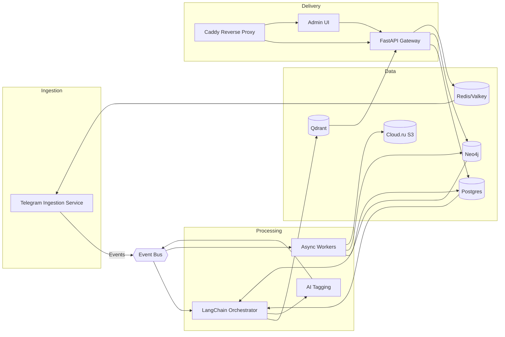

# Архитектурные принципы новой версии Telegram Channel Parser Bot

## 1. Цели и ограничения
- **Сфокусироваться на основном продукте**: стабильный парсинг и обогащение контента каналов Telegram, без вспомогательных сервисов из предыдущей сборки.
- **Минимально достаточная инфраструктура**: запуск без Flowise и других экспериментальных зависимостей, при необходимости масштабирование компонент отдельными контурами. Базовый слой включает Supabase (Postgres + аналитические инструменты), Redis и Caddy.
- **Готовность к развитию**: архитектура должна позволять подключать новые источники данных, модели и способы доставки результатов без переписывания ядра.

## 2. Базовые принципы
1. **Чёткое разделение доменов** — ingestion, прикладной API, обработка/обогащение и аналитика запускаются отдельными сервисами с явными контрактами.
2. **Event-driven** — обмен между сервисами через брокер (Kafka/Redpanda или Redis Streams) и события доменной модели, чтобы не блокировать обработку и упростить масштабирование.
3. **Stateless поверх очередей** — все воркеры и API горизонтально масштабируемы, состояние хранится в Postgres/Cloud.ru S3/Redis.
4. **Устранение SPOF** — каждый компонент имеет стратегию отказоустойчивости: кластеры Redis/Redpanda, репликации Postgres/Neo4j, health-check + auto-restart, DLQ для необработанных событий.
5. **Пакетируемость компонентов** — каждый сервис разворачивается контейнером с собственным lifecycle; локально используется Docker Compose с профилями, в проде — Helm/Ansible.
6. **Богатая модель знаний** — граф Neo4j дополняет реляционные и векторные хранилища, фиксируя связи каналов, сущностей и тем.
7. **LLM-first стратегия** — GigaChat модели (через `gigachain`) выступают базовым слоем генерации и эмбеддингов; fallback-провайдеры (OpenRouter, локальные LLM) подключаются как опциональные расширения с явными договорами качества.
8. **Конфигурация как код** — все параметры описываются в Git (Helm values, Terraform, .env.example), никакой “магии” в скриптах.
9. **Обратная совместимость** — API и события версионируются (URL/заголовки для REST, Schema Registry для топиков), чтобы поэтапно выкатывать обновления без деградации сервиса.

### 2.1 Почему Neo4j уместен
- **Доменные сценарии**: требуется отслеживать цитирование, перекрестные упоминания, совместные аудитории и тематические цепочки каналов — графовые запросы позволяют выявлять влияние и строить рекомендации.
- **Дополнение к RAG**: структурированный контекст (путь в графе) добавляется к векторному поиску, что улучшает объяснимость и качество ответов; LangChain предоставляет GraphCypherQAChain/GraphRAG, что упрощает внедрение.
- **Потоковая синхронизация**: события обрабатываются в потоках, а обновления графа выполняются идемпотентно; Neo4j выдерживает частые upsert'ы и сложные запросы.
- **Контроль затрат**: граф разворачивается отдельным профилем (например, `graph`), поэтому команды без потребности в аналитике по связям могут не запускать его локально.

## 3. Целевая сервисная топология

### 3.1 Telegram Ingestion Service
- Минимальный сервис на Telethon (или Pyrogram) с единственной задачей — подписка и запись событий в очередь.
- Авторизация пользователей изолирована, сессии хранятся в Postgres + Redis (для fast lookup), без прямых зависимостей от API слоя.
- Поддержка многопользовательского режима за счёт конфигурации пулов аккаунтов (worker-per-user).

### 3.2 LangChain Orchestrator
- Заменяет старые сценарии n8n/Flowise: все пайплайны описаны как LangChain chains/graphs.
- Получает события о новых постах, запускает цепочки обогащения (embeddings, summarization, classification).
- Воркеры выполняют тяжёлые задачи асинхронно (Celery/FastStream/Huey), используя Redis или Redpanda как backend.
- Конвейер построен модульно: добавление новой модели = новый Runnable/Tool.

### 3.3 FastAPI Gateway
- REST и веб-сокет API для управления каналами, запросов RAG, админских операций.
- Авторизация через JWT/Telegram Login Widget; роли (user/admin/support) валидируются посредником.
- Отдельные сервисы: `api-gateway`, `admin-panel` (SPA на Next.js/Vite) и `public-webhook` (для кастомных интеграций).

### 3.4 Edge & Access Layer (Caddy)
- Единый reverse proxy для внешних и внутренних клиентов: маршрутизация API, админ-панели, webhook-эндпоинтов и метрик.
- Центральная точка для TLS, OAuth/OIDC-провайдеров и rate limiting на уровне per-route.
- Интеграция с Grafana/Prometheus dashboards, Supabase Studio и другими административными интерфейсами с SSO.

- **Embeddings**: LangChain + адаптер под GigaChat через официальный `gigachain` SDK как основной провайдер; поддержка OpenRouter/локальных моделей как fallback, конфигурируемых per-tenant. Настройки (температура, топ-k, ограничения токенов) стандартизируются и версионируются.
- **Vector DB**: Qdrant/Weaviate с коллекциями per-tenant, хранение метаданных в Postgres.
- **Generative ответ**: LangChain Runnable, совмещающий retrieval, rerank (если нужно) и финальную генерацию. Готовые компоненты `gigachain` используются для согласованной токенизации, а fallback-цепочки OpenRouter управляются через LangChain RouterChain.
- **Tagging**: отдельный воркер, использующий ту же инфраструктуру моделей, что и RAG (общий пул LLM/embedding endpoints). Тонкая настройка промптов и моделей фиксируется в ADR.
- **Enrichment pipeline**: воркеры обогащают посты (заполнение недостающих ссылок, контекст) через Crawl4AI/подобные краулеры. Рекомендации best practice: stateless job per URL, rate limiting с respect robots.txt, кэширование HTTP-ответов в Cloud.ru S3, валидация HTML, а также антивирусные проверки перед сохранением.
- **Image grounding**: GigaChat vision-модели (через gigachain) формируют описания изображений и извлекают ключевые факты. Практики: хранить оригиналы в Cloud.ru S3 с версионированием, сохранять JSON-описания рядом с медиа, валидировать размер и тип файлов до отправки в LLM, внедрять фильтры безопасного контента и human review для спорных изображений.
- **External search grounding**: при генерации ответов дополнительно выполняется federated поиск (SearxNG/Metaphor) с нормализованными snippet’ами. LangChain Retrieval Augmented Generation объединяет внутренний контент и внешние источники, а правила цитирования обязательны для всех сторонних данных.
- **Knowledge Graph**: Neo4j хранит структурированные связи (канал ↔ тема ↔ сущность ↔ событие). Retrieval комбинирует Cypher-запросы и векторный поиск (GraphRAG), что улучшает объяснимость, рекомендации и таргетированные дайджесты.
- **Оценка качества**: LangChain Evaluator Pipeline (например, Ragas) автоматически проверяет ответы по метрикам faithfulness/answer relevance/context precision, фиксируя результаты в Postgres/Neo4j и подсвечивая деградации.
- **Speech services**: транскрибация и озвучка выполняются через SaluteSpeech API с очередями на обработку и контролем качества (WER/latency). Результаты транскрипций версионируются и связываются с исходными сообщениями/медиаконтентом.

### 3.6 Graph Intelligence Service
- Сервис синхронизации Postgres/Qdrant → Neo4j: выделяет сущности (NER/NEL), строит отношения «упоминание», «источник → репост», «канал ↔ тема».
- Обрабатывает события `EntityLinked`, `RelationshipDetected`, `UserInterestUpdated`, создавая граф знаний.
- Предоставляет API/SDK для выборок путей, вычисления центральности, обнаружения сообществ и формирования персональных рекомендаций.

### 3.7 Data Lake & Analytics
- Сырые сообщения и медиаконтент — в Postgres (Supabase) + Cloud.ru S3; преобразованные данные экспортируются в `analytics` схему, при необходимости — в ClickHouse/BigQuery.
- Supabase предоставляет встроенный SQL-редактор, API и row-level security, что упрощает самообслуживание аналитиков и интеграции без прямого доступа к ядру БД.
- Обновление витрин выполняют воркеры через те же LangChain pipelines.
- Графовые витрины (community detection, influencers) рассчитываются в Neo4j и материализуются в Postgres/Supabase для отчётности и API.

## 4. Технологический стек
- **Backend**: Python 3.11+, FastAPI, SQLAlchemy 2.x, LangChain, `gigachain`, Pydantic v2, Celery/FastStream.
- **Messaging**: Kafka/Redpanda (прод) или Redis Streams (dev/mid-size); Schema Registry для контрактов событий.
- **БД**: Postgres (Supabase как управляемая платформа), Redis (кэш/краткоживущие сессии), Qdrant (векторное), Neo4j (граф знаний). Cloud.ru S3/MinIO для файлов. Хранилище результатов внешнего краулинга — отдельный bucket c версионированием.
- **Observability**: OpenTelemetry + Prometheus + Grafana + Loki; отдельные дашборды для Crawl4AI/SearxNG latency и качества.
- **CI/CD**: GitHub Actions/GitLab CI, IaC через Terraform/Ansible; Trivy/Grype для контейнеров Crawl4AI/SearxNG, периодические интеграционные проверки gigachain/GigaChat SLA.

## 5. Управление конфигурацией и секретами
- Pydantic `BaseSettings`/Dynaconf для служб, загрузка из `.env` и секретов (Vault/1Password Secrets Automation).
- Шифрование чувствительных параметров (Telegram API keys, user tokens) с помощью KMS.
- Единая схема версионирования конфигурации (Helm chart + values).
- Строгая валидация входных данных на каждом слое (ingestion, API, webhooks) и политика «минимально необходимых прав» для сервисных аккаунтов.
- Регулярная ротация ключей/паролей, аудит доступа (Vault audit log, Supabase logs) и интеграция сканирования секретов в CI/CD.

## 6. Жизненный цикл данных
1. **Ingestion**: Telethon пишет событие `MessageCreated` в Redpanda, одновременно сохраняя «сырые» данные в Postgres/Supabase для дальнейшего анализа.
2. **Processing**: LangChain orchestrator обрабатывает события, добавляя задачи в очереди (`embedding`, `tagging`, `digest`).
3. **Enrichment**: воркеры Crawl4AI дополняют статьи оригинальными источниками, извлекают ключевые факты, метаданные и ссылки. Отдельная ветка обрабатывает медиа: изображения прогоняются через GigaChat vision-модели (gigachain tools) для описания и классификации, аудио — через SaluteSpeech. Данные проходят санитарную проверку, дедупликацию и связывание с существующими сущностями.
4. **Storage**: результаты обогащения пишутся в Postgres (структурированные поля), Qdrant (вектора, мета) и Neo4j (связи и графовые признаки). HTML/медиа из Crawl4AI/поиска хранится в Cloud.ru S3 c TTL и политиками конфиденциальности. Графовые и текстовые описания изображений от GigaChat сохраняются рядом с медиа для последующего поиска и аудита качества.
5. **Delivery**: FastAPI предоставляет API для запросов, админ-панель отображает витрины, пользовательские оповещения уходят через Telegram/Email/Webhook. Ответы RAG дополняются ссылками на внешние источники (SearxNG/краулеры) с указанием даты получения.
6. **Evaluation loop**: LangChain Evaluator (Ragas/LLM-as-a-judge) формирует задания оценки, обновляет метрики качества ответов и сигнализирует о деградациях.
6. **Feedback loop**: события о запросах пользователя (какие ответы полезны) и результаты автооценки публикуются обратно в Redpanda для обучения scoring/ранжирующих моделей.

## 7. Безопасность и мультиарендность
- Разделение арендаторов на уровне БД (tenant_id в таблицах, Row Level Security для Supabase-совместимости).
- Secrets пользователей (API keys) хранятся в зашифрованном виде (PGP/KMS) и расшифровываются только в воркерах.
- RBAC в API (политики на уровне endpoints, отдельный сервис для аудита действий админов).
- Нео4j изолируется отдельным namespace/сетевым сегментом; доступ только через сервис Graph Intelligence, с аудитом Cypher-запросов и политиками Neo4j RBAC.
- Rate limiting: Redis-based leaky bucket для API и телеграм-операций, дополнительно — WAF-профили на уровне Caddy/облака для защиты от DDoS/Brute-force.
- CI/CD включает SCA/SAST/DAST проверки, регулярные security review и хаос-инжиниринг отказов (например, отключение узла Neo4j).
- Cloud.ru S3: включённое шифрование (SSE-KMS), политика private-by-default, отдельные bucket'ы per-tenant, lifecycle-политики и обязательное сканирование загружаемых файлов (антивирус + DLP) до публикации данных downstream.

## 8. Наблюдаемость и эксплуатация
- Стандартизированные health-checks (`/healthz`, `/readyz`) для каждого сервиса.
- Прозрачная трассировка: каждый event снабжается `trace_id`, которые прокидываются через все компоненты (OTel propagators).
- Стандартизированное структурированное логирование (JSON), централизованный сбор через Loki/ELK, хранение и ретеншн политиками.
- Dashboards: ingestion lag, очереди LangChain, ошибки LLM провайдеров, latency API, метрики Neo4j (количество узлов/рёбер, время выполнения Cypher) и качество RAG (Ragas scores, дрейф ответов). Отдельные панели для Crawl4AI (успешность парсинга, исключения), SaluteSpeech (время транскрибации, WER), GigaChat vision inference (latency, доля успешно обработанных изображений) и SearxNG (latency, доля релевантных результатов).
- Alerting с чёткими SLO/SLA: latency, error rate, resource usage, backlog очередей; эскалация через PagerDuty/Telegram.
- Runbooks и процедуры реагирования на инциденты хранятся в docs/ops/, описывают шаги диагностики/восстановления по каждому сервису.
- Авто-скейлинг воркеров по метрике lag (HPA/KEDA) и сценарии chaos engineering для проверки failover.

### 8.1 Контур оценки качества
- **Evaluator Service**: отдельный воркер, который по расписанию или после релизов прогоняет контрольные запросы и оценивает ответы (Ragas, pairwise LLM оценка).
- **Метрики и алерты**: результаты сохраняются в Postgres/Neo4j, агрегированные показатели экспортируются в Prometheus (например, `ragas_faithfulness_score`). Настраиваются алерты на деградацию качества.
- **Human-in-the-loop**: при падении метрик формируется задача на ручную проверку, аналитики обновляют эталонные ответы или корректируют цепочки LangChain.

## 9. Стратегия тестирования
- **Unit**: модульные тесты для сервисов (ingestion, API, LangChain компоненты), покрытие ключевой логики в изоляции через pytest.
- **Integration**: сценарии взаимодействия сервисов через Event Bus и REST, запуск в docker-compose профиле `test` с in-memory брокером.
- **Functional/E2E**: пользовательские journeys (регистрация, добавление канала, RAG-запрос) через Playwright/pytest-bdd.
- **Performance/Load**: k6/Locust для API и ingestion throughput, отдельные бенчмарки Cypher и векторного поиска.
- **Security**: регулярные сканирования зависимостей (pip-audit, Trivy), SAST (Bandit, Semgrep), DAST (OWASP ZAP), плановые пентесты.
- **Chaos Engineering**: fault injection (выключение брокера, задержки LLM API) в staging, проверка авто-восстановления и поведения DLQ.
- **Test environments**: управляются Terraform/Helm, тестовые данные синтезируются и анонимизируются, CI поднимает ephemeral окружение для MR.
- **Model adapters**: контрактные тесты для `gigachain` (GigaChat embeddings/LLM/vision) и fallback-провайдеров (OpenRouter), включая smoke-проверки на латентность, лимиты токенов и деградацию качества RAG и описаний изображений.

## 10. Управление зависимостями и сборка
- Python-проекты ведутся через Poetry/PDM, зависимости фиксируются `poetry.lock`, проводится регулярное обновление с проверкой совместимости.
- Общие пакеты (модели, схемы) публикуются во внутренний PyPI/Artifactory для переиспользования между сервисами.
- Docker-образы собираются multi-stage (alpine-slim/ubi-micro) с layer caching, проходят сканирование Trivy/Grype; хранятся в централизованном реестре (GitHub Container Registry/ECR).
- Build-пайплайн включает линтеры (ruff/mypy), форматирование (black), генерацию SBOM и подпись образов (cosign).

## 11. Документация и знания
- Автоматическая генерация OpenAPI/Swagger для FastAPI, версионирование схем и публикация в Supabase/портале разработчика.
- Документация по доменной модели (Postgres, Neo4j) поддерживается в `docs/domain/` с ER- и property-диаграммами.
- ADR (Architectural Decision Records) фиксируют ключевые решения; шаблон ADR и процесс ревью прописан в CONTRIBUTING.md.
- Runbooks, чеклисты релизов, инструкции по миграциям и восстановлению публикуются в `docs/ops/` и обновляются вместе с релизами.

## 12. Стратегия развёртывания
- **Dev**: Docker Compose с профилями `core`, `rag`, `analytics`. По умолчанию запускается только `core` (ingestion + API + Postgres/Supabase локальный, Redis).
- **Stage/Prod**: Kubernetes/Ansible — каждый сервис в отдельном deployment; общий ingress (Caddy/Traefik), сервисные аккаунты, NetworkPolicies. Caddy выступает точкой входа для внешних клиентов, Supabase подключается как управляемое окружение для БД/аналитики.
- **Миграции**: Alembic + автогенерация; для LangChain пайплайнов — versioned YAML с описанием graph.

## 13. Roadmap реализации
1. **Инициализация ядра**: Telethon ingestion + FastAPI + Postgres + Redis (без LangChain).
2. **Добавление orchestrator**: внедрить Redpanda/Redis Streams, выделить LangChain сервис и воркеры.
3. **RAG модуль**: подключить Qdrant, настроить LangChain retrieval pipeline, реализовать API.
4. **Graph Intelligence**: развернуть Neo4j, внедрить сервис синхронизации, реализовать GraphRAG/рекомендации.
5. **Quality Evaluation**: развернуть evaluator-пайплайн (Ragas), подключить контрольные датасеты и вывести метрики в мониторинг/Grafana.
6. **Tagging & Analytics**: добавить LLM-based tagging, экспорт витрин, интеграцию с Supabase и внешними BI.
7. **Observability & Security**: ввести OTel, централизованное управление секретами, RBAC и аудит. Настроить Grafana dashboards и Caddy-основанную аутентификацию к административным интерфейсам.

## 14. Миграция с предыдущей версии

### Состояние переходной фазы
- **Старая версия**: Монолитная архитектура с n8n/Flowise
  - Документирована в `docs/OLD_*` файлах
  - Репозиторий: https://github.com/ilyasni/t-bot-for-channels/tree/test-cleanup-fresh
  - Сложная система с множественными зависимостями
- **Новая версия**: Event-driven микросервисы с LangChain
  - Описана в `ARCHITECTURE_PRINCIPLES.md`
  - Минимально достаточная инфраструктура
  - LangChain-ориентированная обработка

### План миграции
1. **Сохранение совместимости API** где возможно
2. **Поэтапный переход сервисов** согласно roadmap
3. **Сохранение данных пользователей** без потерь
4. **Документирование изменений** в `docs/MIGRATION_GUIDE.md`

### Ключевые изменения
- **От n8n/Flowise к LangChain** — все пайплайны описаны как LangChain chains/graphs
- **От монолита к микросервисам** — четкое разделение доменов
- **От SQLite к Postgres** — расширенная схема с мульти-тенантностью
- **Добавление векторных БД** — Qdrant для RAG, Neo4j для графов

### Совместимость
- **API endpoints** — частично совместимы (версионирование)
- **Схема БД** — расширена, но обратно совместима
- **Пользовательские данные** — полностью сохранены
- **Конфигурация** — мигрируется автоматически

---

Этот документ фиксирует фундаментальную архитектуру новой версии, исключает Flowise и другие неиспользуемые элементы, и закладывает основу для последовательного развития продукта вокруг LangChain и ядра Telegram-парсера.
