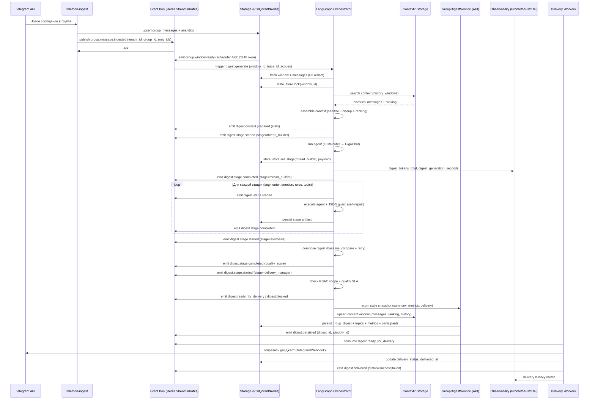

# Мультиагентный data-flow и event-driven контур групповых дайджестов

## 1. Цель документа
- Зафиксировать целевую последовательность событий для пайплайна групповых дайджестов в новой архитектуре.
- Обеспечить совместимость с Context7 best practices (`Context Engineering`, `LangGraph4Context7`) и принципами из `ARCHITECTURE_PRINCIPLES.md`.
- Использовать документ при разработке guardrails агентов, observability и механизмов self-repair.

## 2. Логические компоненты
1. **Ingest слой** — `telethon-ingest`, отвечает за приём сообщений из Telegram (паттерны `telethon-floodwait-001`, `telethon-qr-ttl-002`).
2. **Storage & Windows** — Postgres (`group_messages`, `group_conversation_windows`), Redis Streams/Kafka (event bus), Qdrant (векторное хранилище).
3. **Orchestration** — LangGraph `GroupDigestOrchestrator` + `DigestStateStore` (Redis + PG) для идемпотентности.
4. **Quality & Delivery loop** — агенты анализа, self-validation (Stage 2), delivery manager, circuit breaker/DLQ (Stage 3).
5. **Observability / Control plane** — Prometheus, OpenTelemetry, Grafana (heatmaps, sampling), Context7 maintenance cycle (`/davidkimai/context-engineering`).

## 3. Поток данных (mermaid sequence)

## 4. Таблица событий и гарантий

| Событие | Продюсер | Основные поля payload | Идемпотентность / ключи | Контекст7 / правила |
| --- | --- | --- | --- | --- |
| `group.message.ingested.v1` | `telethon-ingest` | `tenant_id`, `group_id`, `messages[]`, `ingest_trace_id` | `msg_id` + `tenant_id` | Telethon patterns (`telethon-floodwait-001`), masking PII (Context7 logging) |
| `group.window.ready.v1` | Scheduler (`windows_builder`) | `window_id`, `group_id`, `tenant_id`, `window_start/end`, `message_count`, `scopes[]` | `window_id` | ARCHITECTURE_PRINCIPLES (event-driven), ensure RLS (`app.current_tenant`) |
| `digest.generate.requested.v1` | API / Scheduler | `window_id`, `trace_id`, `delivery_channel`, `requested_by` | `window_id` + `version` | Context7 orchestrator best practices (`ResilientMultiAgentSystem`) |
| `digest.context.prepared.v1` | LangGraph Orchestrator | `window_id`, `message_total`, `duplicates_removed`, `top_ranked`, `stats` | `window_id` | Context service (Stage 5) — служит input для downstream агентов |
| `digest.stage.started.v1` | LangGraph Orchestrator | `window_id`, `stage`, `schema_version`, `model_id`, `trace_id` | `window_id` + `stage` | Используется для telemetry, checkpointer (LangGraph) |
| `digest.stage.completed.v1` | LangGraph Orchestrator | `window_id`, `stage`, `outcome` (`ok`, `retry`, `fallback`), `quality_metrics` | `window_id` + `stage` + `run_id` | Self-repair loop (`check_boundary_integrity`, baseline compare) |
| `digest.blocked.v1` | Delivery manager | `window_id`, `reason`, `quality_score`, `missing_scopes[]` | `window_id` | RBAC проверка (`DIGEST_DELIVERY_SCOPE`), circuit breaker (todo Stage 3) |
| `digest.ready_for_delivery.v1` | Delivery manager | `window_id`, `digest_id`, `delivery_payload`, `channels[]` | `digest_id` | Используется worker'ом доставки, ссылка на artifacts |
| `digest.persisted.v1` | GroupDigestService | `digest_id`, `window_id`, `tenant_id`, `metrics`, `topics` | `digest_id` | Ensures DB commit завершён (two-phase optional) |
| `digest.delivered.v1` | Delivery worker | `digest_id`, `status`, `delivered_at`, `channel`, `error` | `digest_id` + `status` | Включает DLQ ветку (`status=failed`) |
| `digest.dlq.v1` | Delivery/Orchestrator | `digest_id`, `stage`, `error`, `retry_count`, `next_action` | `digest_id` + `stage` | Планируется в todo Stage 3 (расширенный retry) |

## 5. Контроль качества и self-repair loop
- **JSON guard**: каждый агент возвращает JSON, проверяется `worker/common/json_guard.py`; при невалидности запускается self-repair промпт (`Context7` control shells).
- **Baseline comparison**: `worker/common/baseline_compare.py` сравнивает `current_digest` с предыдущим окном; расхождения > SLA отправляются в `digest.stage.completed` с outcome=`degraded`.
- **Quality SLA**: `quality_score >= DIGEST_QUALITY_THRESHOLD`; иначе `digest.blocked.v1` и запуск корректирующего синтеза (todo Stage 2).
- **Boundary integrity**: перед запуском агентов вызывается `check_boundary_integrity()` (Context Engineering) для проверки контекстов агентов.
- **Maintenance cycle**: ночной job вызывает maintenance для обновления доменов агентов и отчёт `maintenance_status` (Context7 maintenance_cycle).

## 6. Observability и метрики
- Prometheus:  
  - `digest_generation_seconds{stage, outcome}`  
  - `digest_tokens_total{model}`  
  - `digest_quality_score{threshold}`  
  - `digest_delivery_latency_seconds{channel}`  
  - `digest_synthesis_fallback_total{reason}`  
  - `digest_stage_status_total{stage="ingest_validator",status="context_trimmed|context_dedup|context_history"}`  
  - `digest_context_messages{metric="original|deduplicated"}`  
  - `digest_context_duplicates_total{tenant}`  
  - `digest_context_history_matches_total{tenant}`  
- OpenTelemetry: спаны `group_digest_orchestrator.<stage>` с атрибутами `tenant_id`, `window_id`, `model_id`, `retry`.
- Grafana heatmaps (todo Stage 4): `quality_score` vs окно, `latency` vs stage, `fallback_rate` vs tenant.
- Лог-сэмплирование: 1% успешных, 100% ошибок, маскирование PII (Context7 logging guidelines).

## 7. Управление рисками
- **Race conditions**: `DigestStateStore` использует Redis lock + PG уникальный индекс (`ux_digest_stage_artifacts_stage`).
- **Повторная доставка**: `digest.ready_for_delivery` подписан на `delivery_status` в PG; DLQ предотвращает дублирование.
- **Мульти-тенантность**: все события содержат `tenant_id`, в worker'ах используется `current_setting('app.current_tenant')` (см. миграцию 20250211…).
- **Стоимость LLM**: квоты `DIGEST_PRO_QUOTA_*`, fallback `pro→base`, отдельные метрики `gigachat_requests_total`.
- **Безопасность**: RBAC scopes (`DIGEST_READ/DIGEST_ADMIN`), PII redaction перед LangGraph, audit trail событий.

## 8. Feature flag & canary rollout
- Контроль доступа осуществляется на уровне API (`POST /api/groups/{id}/digest`): вызывающий tenant должен иметь включённый глобальный флаг `DIGEST_AGENT_ENABLED` либо входить в allow-list `DIGEST_AGENT_CANARY_TENANTS`. В противном случае возвращается `403`, событие в очередь не отправляется.
- Список canary арендаторов синхронизируется через конфиг (`env` / ConfigMap), поддерживает CSV и JSON. Для продакшена рекомендуется включать не более 10% арендаторов за итерацию (Context7 rollout best practice).
- При полном включении необходимо выставить `DIGEST_AGENT_ENABLED=1` и очистить canary-список, чтобы избежать разночтений.
- Метрики rollout: `digest_stage_status_total{result="blocked", reason="feature_flag"}` (добавить в Grafana), логи `Group digest rollout blocked for tenant`.

## 9. Следующие шаги
1. Реализовать публикацию/консьюмеров для перечня событий (LangGraph → bus) в коде (после подготовки инфраструктуры).
2. Обновить `docs/API_CONTRACTS.md` и схему событий (JSON Schema) согласно этой спецификации.
3. Синхронизировать todo Stage 2 (self-validation, baseline, retry) с расписанными событиями.
4. Подготовить Grafana dashboard с heatmaps по stage/tenant (todo Stage 4).
5. Настроить DLQ и circuit breaker (todo Stage 3) с использованием `digest.dlq.v1`.

