# Репозиторий с первой версией проекта
https://github.com/ilyasni/t-bot-for-channels/tree/test-cleanup-fresh

# Telegram Channel Parser Bot - Пайплайны работы системы

> **Версия:** 3.1  
> **Дата:** 12 октября 2025  
> **Проект:** n8n-server / Telegram Channel Parser + RAG System + QR Login + Admin Panel

## Содержание

1. [User Journeys](#1-user-journeys)
2. [Background Processes](#2-background-processes)
3. [Admin Workflows](#3-admin-workflows)
4. [Error Handling Flows](#4-error-handling-flows)
5. [Integration Flows](#5-integration-flows)

---

## 1. User Journeys

### 1.1 Полный цикл регистрации пользователя

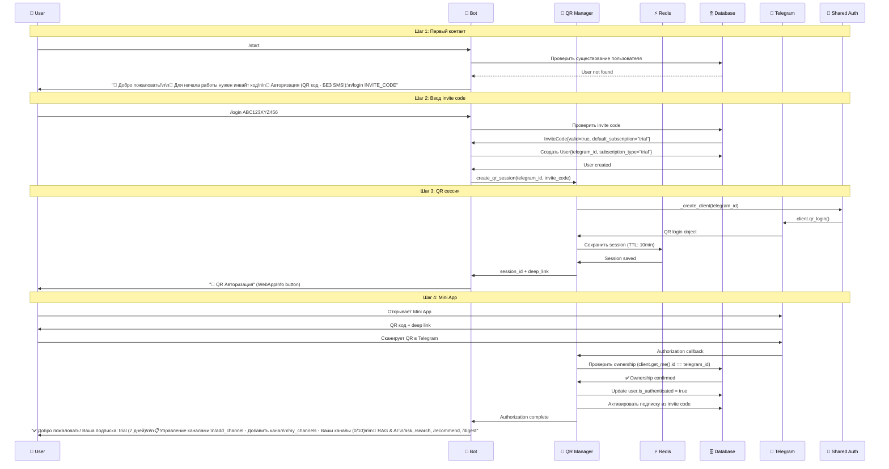
```mermaid
sequenceDiagram
    participant U as 👤 User
    participant B as 🤖 Bot
    participant Q as 🔐 QR Manager
    participant R as ⚡ Redis
    participant D as 🗄️ Database
    participant T as 📱 Telegram
    participant S as 🔐 Shared Auth
    
    Note over U,S: Шаг 1: Первый контакт
    U->>B: /start
    B->>D: Проверить существование пользователя
    D-->>B: User not found
    B->>U: "🤖 Добро пожаловать!\n\n🎫 Для начала работы нужен инвайт код\n\n📱 Авторизация (QR код - БЕЗ SMS!):\n/login INVITE_CODE"
    
    Note over U,S: Шаг 2: Ввод invite code
    U->>B: /login ABC123XYZ456
    B->>D: Проверить invite code
    D->>B: InviteCode{valid=true, default_subscription="trial"}
    B->>D: Создать User{telegram_id, subscription_type="trial"}
    D->>B: User created
    B->>Q: create_qr_session(telegram_id, invite_code)
    
    Note over U,S: Шаг 3: QR сессия
    Q->>S: _create_client(telegram_id)
    S->>T: client.qr_login()
    T->>Q: QR login object
    Q->>R: Сохранить session (TTL: 10min)
    R->>Q: Session saved
    Q->>B: session_id + deep_link
    B->>U: "🔐 QR Авторизация" (WebAppInfo button)
    
    Note over U,S: Шаг 4: Mini App
    U->>T: Открывает Mini App
    T->>U: QR код + deep link
    U->>T: Сканирует QR в Telegram
    T->>Q: Authorization callback
    Q->>D: Проверить ownership (client.get_me().id == telegram_id)
    D->>Q: ✅ Ownership confirmed
    Q->>D: Update user.is_authenticated = true
    Q->>D: Активировать подписку из invite code
    Q->>B: Authorization complete
    B->>U: "✅ Добро пожаловать! Ваша подписка: trial (7 дней)\n\n📋 Управление каналами:\n/add_channel - Добавить канал\n/my_channels - Ваши каналы (0/10)\n\n🤖 RAG & AI:\n/ask, /search, /recommend, /digest"
```

### 1.2 Добавление и настройка канала

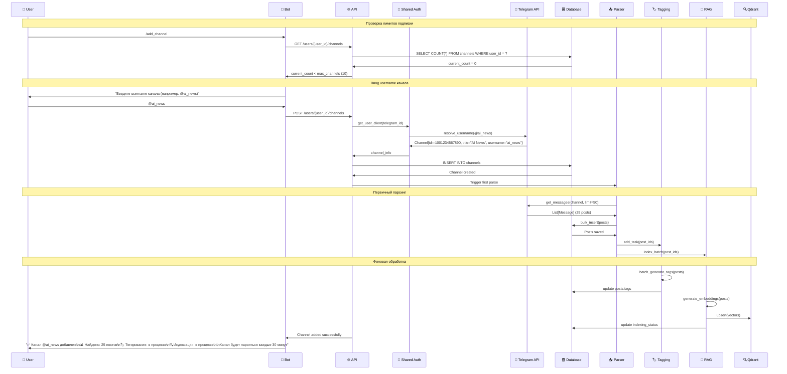
```mermaid
sequenceDiagram
    participant U as 👤 User
    participant B as 🤖 Bot
    participant A as 🌐 API
    participant S as 🔐 Shared Auth
    participant T as 📱 Telegram API
    participant D as 🗄️ Database
    participant P as 📥 Parser
    participant G as 🏷️ Tagging
    participant R as 🧠 RAG
    participant Q as 🔍 Qdrant
    
    Note over U,Q: Проверка лимитов подписки
    U->>B: /add_channel
    B->>A: GET /users/{user_id}/channels
    A->>D: SELECT COUNT(*) FROM channels WHERE user_id = ?
    D->>A: current_count = 0
    A->>B: current_count < max_channels (10)
    
    Note over U,Q: Ввод username канала
    B->>U: "Введите username канала (например: @ai_news)"
    U->>B: @ai_news
    B->>A: POST /users/{user_id}/channels
    A->>S: get_user_client(telegram_id)
    S->>T: resolve_username(@ai_news)
    T->>S: Channel{id=-1001234567890, title="AI News", username="ai_news"}
    S->>A: channel_info
    A->>D: INSERT INTO channels
    D->>A: Channel created
    A->>P: Trigger first parse
    
    Note over U,Q: Первичный парсинг
    P->>T: get_messages(channel, limit=50)
    T->>P: List[Message] (25 posts)
    P->>D: bulk_insert(posts)
    D->>P: Posts saved
    P->>G: add_task(post_ids)
    P->>R: index_batch(post_ids)
    
    Note over U,Q: Фоновая обработка
    G->>G: batch_generate_tags(posts)
    G->>D: update posts.tags
    R->>R: generate_embeddings(posts)
    R->>Q: upsert(vectors)
    R->>D: update indexing_status
    
    A->>B: Channel added successfully
    B->>U: "✅ Канал @ai_news добавлен!\n📊 Найдено: 25 постов\n🏷️ Тегирование: в процессе\n🔍 Индексация: в процессе\n\nКанал будет парситься каждые 30 минут"
```

### 1.3 RAG-запрос с кешированием

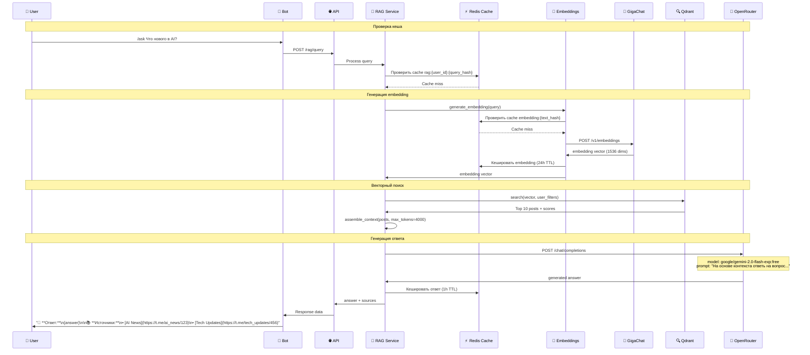
```mermaid
sequenceDiagram
    participant U as 👤 User
    participant B as 🤖 Bot
    participant A as 🌐 API
    participant R as 🧠 RAG Service
    participant C as ⚡ Redis Cache
    participant E as 🧠 Embeddings
    participant G as 🤖 GigaChat
    participant Q as 🔍 Qdrant
    participant O as 🧠 OpenRouter
    
    Note over U,O: Проверка кеша
    U->>B: /ask Что нового в AI?
    B->>A: POST /rag/query
    A->>R: Process query
    R->>C: Проверить cache rag:{user_id}:{query_hash}
    C-->>R: Cache miss
    
    Note over U,O: Генерация embedding
    R->>E: generate_embedding(query)
    E->>C: Проверить cache embedding:{text_hash}
    C-->>E: Cache miss
    E->>G: POST /v1/embeddings
    G->>E: embedding vector (1536 dims)
    E->>C: Кешировать embedding (24h TTL)
    E->>R: embedding vector
    
    Note over U,O: Векторный поиск
    R->>Q: search(vector, user_filters)
    Q->>R: Top 10 posts + scores
    R->>R: assemble_context(posts, max_tokens=4000)
    
    Note over U,O: Генерация ответа
    R->>O: POST /chat/completions
    Note over O: model: google/gemini-2.0-flash-exp:free<br/>prompt: "На основе контекста ответь на вопрос..."
    O->>R: generated answer
    R->>C: Кешировать ответ (1h TTL)
    R->>A: answer + sources
    A->>B: Response data
    B->>U: "📝 **Ответ:**\n{answer}\n\n📚 **Источники:**\n• [AI News](https://t.me/ai_news/123)\n• [Tech Updates](https://t.me/tech_updates/456)"
```

### 1.4 Гибридный поиск (посты + веб)

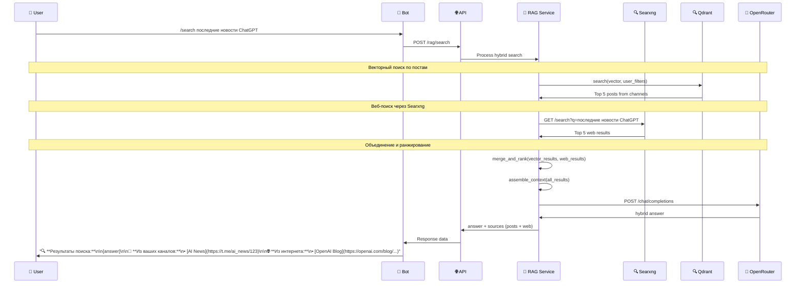
```mermaid
sequenceDiagram
    participant U as 👤 User
    participant B as 🤖 Bot
    participant A as 🌐 API
    participant R as 🧠 RAG Service
    participant S as 🔍 Searxng
    participant Q as 🔍 Qdrant
    participant O as 🧠 OpenRouter
    
    U->>B: /search последние новости ChatGPT
    B->>A: POST /rag/search
    A->>R: Process hybrid search
    
    Note over U,O: Векторный поиск по постам
    R->>Q: search(vector, user_filters)
    Q->>R: Top 5 posts from channels
    
    Note over U,O: Веб-поиск через Searxng
    R->>S: GET /search?q=последние новости ChatGPT
    S->>R: Top 5 web results
    
    Note over U,O: Объединение и ранжирование
    R->>R: merge_and_rank(vector_results, web_results)
    R->>R: assemble_context(all_results)
    R->>O: POST /chat/completions
    O->>R: hybrid answer
    R->>A: answer + sources (posts + web)
    A->>B: Response data
    B->>U: "🔍 **Результаты поиска:**\n\n{answer}\n\n📱 **Из ваших каналов:**\n• [AI News](https://t.me/ai_news/123)\n\n🌐 **Из интернета:**\n• [OpenAI Blog](https://openai.com/blog/...)"
```

### 1.5 Настройка AI-дайджестов

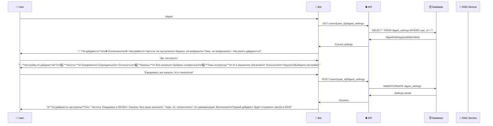
```mermaid
sequenceDiagram
    participant U as 👤 User
    participant B as 🤖 Bot
    participant A as 🌐 API
    participant D as 🗄️ Database
    participant R as 🧠 RAG Service
    
    U->>B: /digest
    B->>A: GET /users/{user_id}/digest_settings
    A->>D: SELECT * FROM digest_settings WHERE user_id = ?
    D->>A: DigestSettings{enabled=false}
    A->>B: Current settings
    B->>U: "📧 **AI-дайджесты**\n\n❌ Отключены\n\n⚙️ Настройки:\n• Частота: не настроено\n• Каналы: не выбраны\n• Темы: не выбраны\n\n🔧 Настроить дайджесты?"
    
    U->>B: "Да, настроить"
    B->>U: "📧 **Настройка AI-дайджестов**\n\n1️⃣ **Частота:**\n• Ежедневно\n• Еженедельно\n• Отключить\n\n2️⃣ **Каналы:**\n• Все каналы\n• Выбрать конкретные\n\n3️⃣ **Темы интересов:**\n• AI и машинное обучение\n• Технологии\n• Наука\n\nВыберите настройки:"
    
    U->>B: "Ежедневно, все каналы, AI и технологии"
    B->>A: POST /users/{user_id}/digest_settings
    A->>D: INSERT/UPDATE digest_settings
    D->>A: Settings saved
    A->>B: Success
    B->>U: "✅ **AI-дайджесты настроены!**\n\n📅 Частота: Ежедневно в 09:00\n📱 Каналы: Все ваши каналы\n🎯 Темы: AI, технологии\n🤖 AI-суммаризация: Включена\n\nПервый дайджест будет отправлен завтра в 09:00"
```

---

## 2. Background Processes

### 2.1 Автоматический парсинг каналов

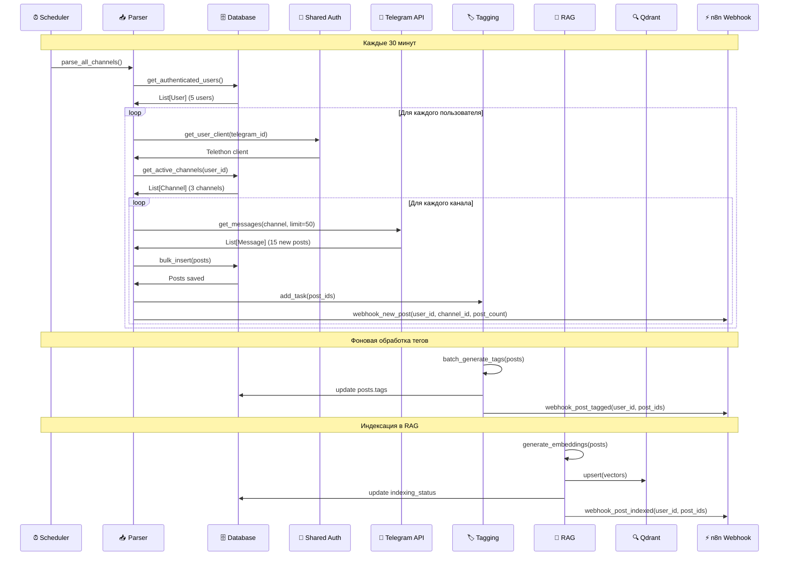
```mermaid
sequenceDiagram
    participant S as ⏰ Scheduler
    participant P as 📥 Parser
    participant D as 🗄️ Database
    participant A as 🔐 Shared Auth
    participant T as 📱 Telegram API
    participant G as 🏷️ Tagging
    participant R as 🧠 RAG
    participant Q as 🔍 Qdrant
    participant N as ⚡ n8n Webhook
    
    Note over S,N: Каждые 30 минут
    S->>P: parse_all_channels()
    P->>D: get_authenticated_users()
    D->>P: List[User] (5 users)
    
    loop Для каждого пользователя
        P->>A: get_user_client(telegram_id)
        A->>P: Telethon client
        P->>D: get_active_channels(user_id)
        D->>P: List[Channel] (3 channels)
        
        loop Для каждого канала
            P->>T: get_messages(channel, limit=50)
            T->>P: List[Message] (15 new posts)
            P->>D: bulk_insert(posts)
            D->>P: Posts saved
            P->>G: add_task(post_ids)
            P->>N: webhook_new_post(user_id, channel_id, post_count)
        end
    end
    
    Note over S,N: Фоновая обработка тегов
    G->>G: batch_generate_tags(posts)
    G->>D: update posts.tags
    G->>N: webhook_post_tagged(user_id, post_ids)
    
    Note over S,N: Индексация в RAG
    R->>R: generate_embeddings(posts)
    R->>Q: upsert(vectors)
    R->>D: update indexing_status
    R->>N: webhook_post_indexed(user_id, post_ids)
```

### 2.2 AI-тегирование постов

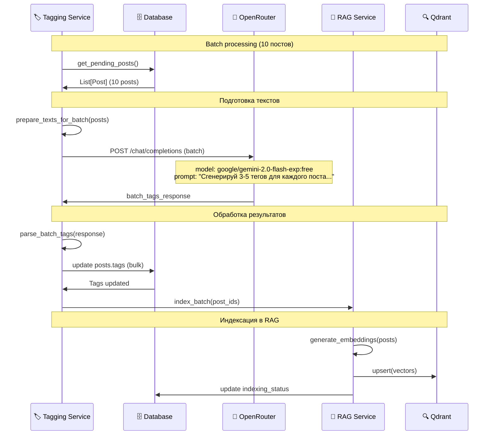
```mermaid
sequenceDiagram
    participant G as 🏷️ Tagging Service
    participant D as 🗄️ Database
    participant O as 🧠 OpenRouter
    participant R as 🧠 RAG Service
    participant Q as 🔍 Qdrant
    
    Note over G,Q: Batch processing (10 постов)
    G->>D: get_pending_posts()
    D->>G: List[Post] (10 posts)
    
    Note over G,Q: Подготовка текстов
    G->>G: prepare_texts_for_batch(posts)
    G->>O: POST /chat/completions (batch)
    Note over O: model: google/gemini-2.0-flash-exp:free<br/>prompt: "Сгенерируй 3-5 тегов для каждого поста..."
    O->>G: batch_tags_response
    
    Note over G,Q: Обработка результатов
    G->>G: parse_batch_tags(response)
    G->>D: update posts.tags (bulk)
    D->>G: Tags updated
    G->>R: index_batch(post_ids)
    
    Note over G,Q: Индексация в RAG
    R->>R: generate_embeddings(posts)
    R->>Q: upsert(vectors)
    R->>D: update indexing_status
```

### 2.3 Генерация AI-дайджестов

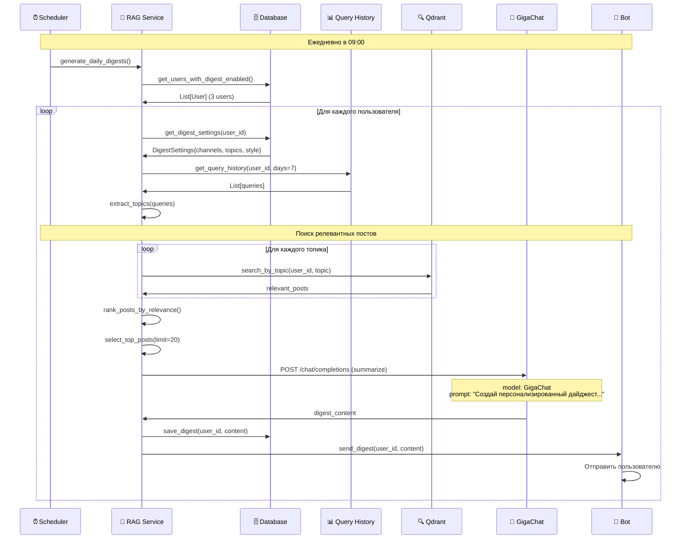
```mermaid
sequenceDiagram
    participant S as ⏰ Scheduler
    participant R as 🧠 RAG Service
    participant D as 🗄️ Database
    participant H as 📊 Query History
    participant Q as 🔍 Qdrant
    participant G as 🤖 GigaChat
    participant B as 🤖 Bot
    
    Note over S,B: Ежедневно в 09:00
    S->>R: generate_daily_digests()
    R->>D: get_users_with_digest_enabled()
    D->>R: List[User] (3 users)
    
    loop Для каждого пользователя
        R->>D: get_digest_settings(user_id)
        D->>R: DigestSettings{channels, topics, style}
        
        R->>H: get_query_history(user_id, days=7)
        H->>R: List[queries]
        R->>R: extract_topics(queries)
        
        Note over S,B: Поиск релевантных постов
        loop Для каждого топика
            R->>Q: search_by_topic(user_id, topic)
            Q->>R: relevant_posts
        end
        
        R->>R: rank_posts_by_relevance()
        R->>R: select_top_posts(limit=20)
        R->>G: POST /chat/completions (summarize)
        Note over G: model: GigaChat<br/>prompt: "Создай персонализированный дайджест..."
        G->>R: digest_content
        R->>D: save_digest(user_id, content)
        R->>B: send_digest(user_id, content)
        B->>B: Отправить пользователю
    end
```

### 2.4 Очистка старых постов (Retention)

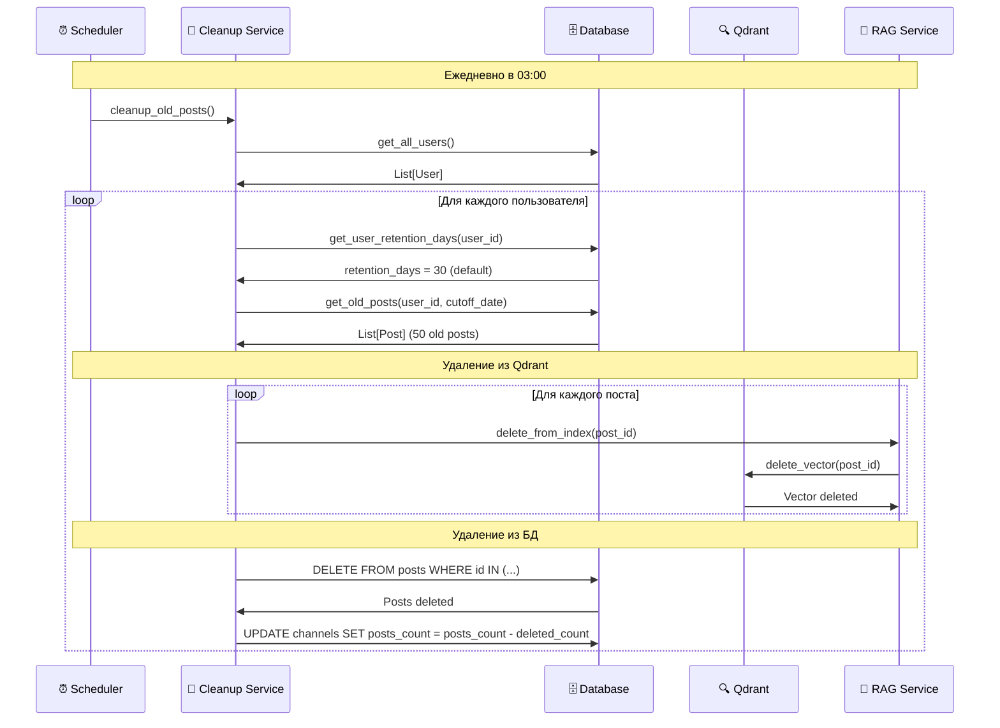
```mermaid
sequenceDiagram
    participant S as ⏰ Scheduler
    participant C as 🧹 Cleanup Service
    participant D as 🗄️ Database
    participant Q as 🔍 Qdrant
    participant R as 🧠 RAG Service
    
    Note over S,R: Ежедневно в 03:00
    S->>C: cleanup_old_posts()
    C->>D: get_all_users()
    D->>C: List[User]
    
    loop Для каждого пользователя
        C->>D: get_user_retention_days(user_id)
        D->>C: retention_days = 30 (default)
        C->>D: get_old_posts(user_id, cutoff_date)
        D->>C: List[Post] (50 old posts)
        
        Note over S,R: Удаление из Qdrant
        loop Для каждого поста
            C->>R: delete_from_index(post_id)
            R->>Q: delete_vector(post_id)
            Q->>R: Vector deleted
        end
        
        Note over S,R: Удаление из БД
        C->>D: DELETE FROM posts WHERE id IN (...)
        D->>C: Posts deleted
        C->>D: UPDATE channels SET posts_count = posts_count - deleted_count
    end
```

---

## 3. Admin Workflows

### 3.1 Полный цикл админ-панели

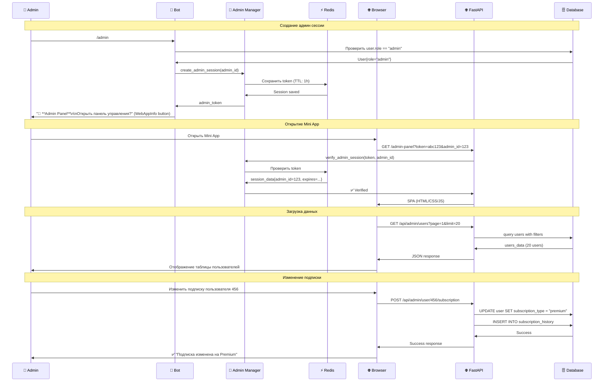
```mermaid
sequenceDiagram
    participant A as 👑 Admin
    participant B as 🤖 Bot
    participant M as 🔐 Admin Manager
    participant R as ⚡ Redis
    participant W as 🌐 Browser
    participant F as 🌐 FastAPI
    participant D as 🗄️ Database
    
    Note over A,D: Создание админ сессии
    A->>B: /admin
    B->>D: Проверить user.role == "admin"
    D->>B: User{role="admin"}
    B->>M: create_admin_session(admin_id)
    M->>R: Сохранить token (TTL: 1h)
    R->>M: Session saved
    M->>B: admin_token
    B->>A: "👑 **Admin Panel**\n\nОткрыть панель управления?" (WebAppInfo button)
    
    Note over A,D: Открытие Mini App
    A->>W: Открыть Mini App
    W->>F: GET /admin-panel?token=abc123&admin_id=123
    F->>M: verify_admin_session(token, admin_id)
    M->>R: Проверить token
    R->>M: session_data{admin_id=123, expires=...}
    M->>F: ✅ Verified
    F->>W: SPA (HTML/CSS/JS)
    
    Note over A,D: Загрузка данных
    W->>F: GET /api/admin/users?page=1&limit=20
    F->>D: query users with filters
    D->>F: users_data (20 users)
    F->>W: JSON response
    W->>A: Отображение таблицы пользователей
    
    Note over A,D: Изменение подписки
    A->>W: Изменить подписку пользователя 456
    W->>F: POST /api/admin/user/456/subscription
    F->>D: UPDATE user SET subscription_type = "premium"
    F->>D: INSERT INTO subscription_history
    D->>F: Success
    F->>W: Success response
    W->>A: ✅ "Подписка изменена на Premium"
```

### 3.2 Создание invite codes

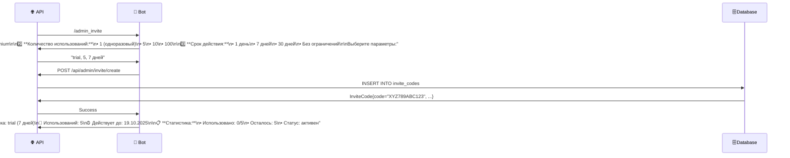
```mermaid
sequenceDiagram
    participant A as 👑 Admin
    participant B as 🤖 Bot
    participant A as 🌐 API
    participant D as 🗄️ Database
    
    A->>B: /admin_invite
    B->>A: "🎫 **Создание Invite Code**\n\n1️⃣ **Подписка по умолчанию:**\n• free\n• trial (7 дней)\n• basic\n• premium\n\n2️⃣ **Количество использований:**\n• 1 (одноразовый)\n• 5\n• 10\n• 100\n\n3️⃣ **Срок действия:**\n• 1 день\n• 7 дней\n• 30 дней\n• Без ограничений\n\nВыберите параметры:"
    
    A->>B: "trial, 5, 7 дней"
    B->>A: POST /api/admin/invite/create
    A->>D: INSERT INTO invite_codes
    D->>A: InviteCode{code="XYZ789ABC123", ...}
    A->>B: Success
    B->>A: "✅ **Invite Code создан!**\n\n🎫 Код: `XYZ789ABC123`\n💎 Подписка: trial (7 дней)\n👥 Использований: 5\n⏰ Действует до: 19.10.2025\n\n📋 **Статистика:**\n• Использовано: 0/5\n• Осталось: 5\n• Статус: активен"
```

### 3.3 Управление пользователями

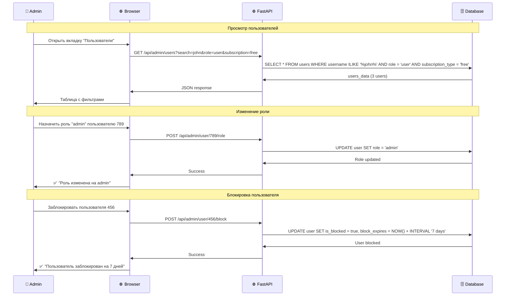
```mermaid
sequenceDiagram
    participant A as 👑 Admin
    participant W as 🌐 Browser
    participant F as 🌐 FastAPI
    participant D as 🗄️ Database
    
    Note over A,D: Просмотр пользователей
    A->>W: Открыть вкладку "Пользователи"
    W->>F: GET /api/admin/users?search=john&role=user&subscription=free
    F->>D: SELECT * FROM users WHERE username ILIKE '%john%' AND role = 'user' AND subscription_type = 'free'
    D->>F: users_data (3 users)
    F->>W: JSON response
    W->>A: Таблица с фильтрами
    
    Note over A,D: Изменение роли
    A->>W: Назначить роль "admin" пользователю 789
    W->>F: POST /api/admin/user/789/role
    F->>D: UPDATE user SET role = 'admin'
    D->>F: Role updated
    F->>W: Success
    W->>A: ✅ "Роль изменена на admin"
    
    Note over A,D: Блокировка пользователя
    A->>W: Заблокировать пользователя 456
    W->>F: POST /api/admin/user/456/block
    F->>D: UPDATE user SET is_blocked = true, block_expires = NOW() + INTERVAL '7 days'
    D->>F: User blocked
    F->>W: Success
    W->>A: ✅ "Пользователь заблокирован на 7 дней"
```

---

## 4. Error Handling Flows

### 4.1 QR Login ошибки

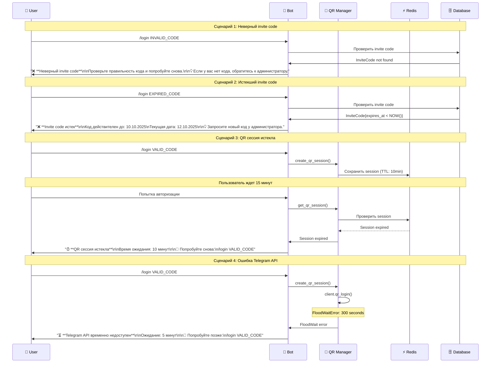
```mermaid
sequenceDiagram
    participant U as 👤 User
    participant B as 🤖 Bot
    participant Q as 🔐 QR Manager
    participant R as ⚡ Redis
    participant D as 🗄️ Database
    
    Note over U,D: Сценарий 1: Неверный invite code
    U->>B: /login INVALID_CODE
    B->>D: Проверить invite code
    D->>B: InviteCode not found
    B->>U: "❌ **Неверный invite code**\n\nПроверьте правильность кода и попробуйте снова.\n\n💡 Если у вас нет кода, обратитесь к администратору."
    
    Note over U,D: Сценарий 2: Истекший invite code
    U->>B: /login EXPIRED_CODE
    B->>D: Проверить invite code
    D->>B: InviteCode{expires_at < NOW()}
    B->>U: "❌ **Invite code истек**\n\nКод действителен до: 10.10.2025\nТекущая дата: 12.10.2025\n\n💡 Запросите новый код у администратора."
    
    Note over U,D: Сценарий 3: QR сессия истекла
    U->>B: /login VALID_CODE
    B->>Q: create_qr_session()
    Q->>R: Сохранить session (TTL: 10min)
    Note over U,D: Пользователь ждет 15 минут
    U->>B: Попытка авторизации
    B->>Q: get_qr_session()
    Q->>R: Проверить session
    R-->>Q: Session expired
    Q->>B: Session expired
    B->>U: "⏰ **QR сессия истекла**\n\nВремя ожидания: 10 минут\n\n🔄 Попробуйте снова:\n/login VALID_CODE"
    
    Note over U,D: Сценарий 4: Ошибка Telegram API
    U->>B: /login VALID_CODE
    B->>Q: create_qr_session()
    Q->>Q: client.qr_login()
    Note over Q: FloodWaitError: 300 seconds
    Q->>B: FloodWait error
    B->>U: "⏳ **Telegram API временно недоступен**\n\nОжидание: 5 минут\n\n🔄 Попробуйте позже:\n/login VALID_CODE"
```

### 4.2 Парсинг ошибки

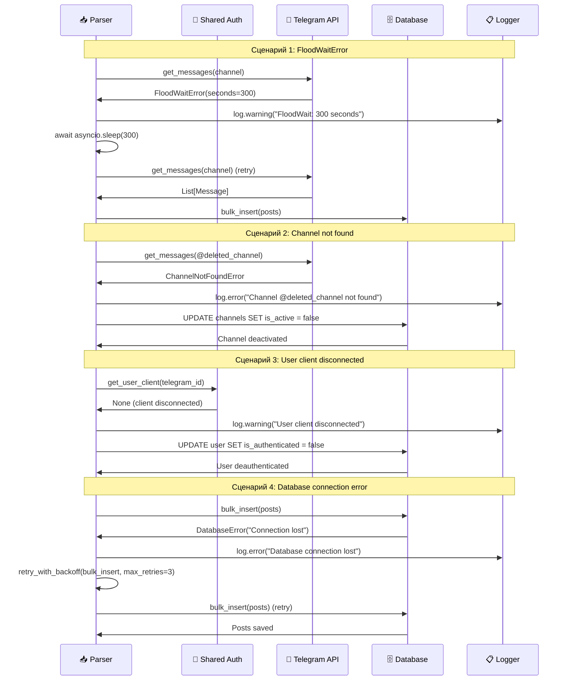
```mermaid
sequenceDiagram
    participant P as 📥 Parser
    participant A as 🔐 Shared Auth
    participant T as 📱 Telegram API
    participant D as 🗄️ Database
    participant L as 📋 Logger
    
    Note over P,L: Сценарий 1: FloodWaitError
    P->>T: get_messages(channel)
    T->>P: FloodWaitError(seconds=300)
    P->>L: log.warning("FloodWait: 300 seconds")
    P->>P: await asyncio.sleep(300)
    P->>T: get_messages(channel) (retry)
    T->>P: List[Message]
    P->>D: bulk_insert(posts)
    
    Note over P,L: Сценарий 2: Channel not found
    P->>T: get_messages(@deleted_channel)
    T->>P: ChannelNotFoundError
    P->>L: log.error("Channel @deleted_channel not found")
    P->>D: UPDATE channels SET is_active = false
    D->>P: Channel deactivated
    
    Note over P,L: Сценарий 3: User client disconnected
    P->>A: get_user_client(telegram_id)
    A->>P: None (client disconnected)
    P->>L: log.warning("User client disconnected")
    P->>D: UPDATE user SET is_authenticated = false
    D->>P: User deauthenticated
    
    Note over P,L: Сценарий 4: Database connection error
    P->>D: bulk_insert(posts)
    D->>P: DatabaseError("Connection lost")
    P->>L: log.error("Database connection lost")
    P->>P: retry_with_backoff(bulk_insert, max_retries=3)
    P->>D: bulk_insert(posts) (retry)
    D->>P: Posts saved
```

### 4.3 RAG Service ошибки

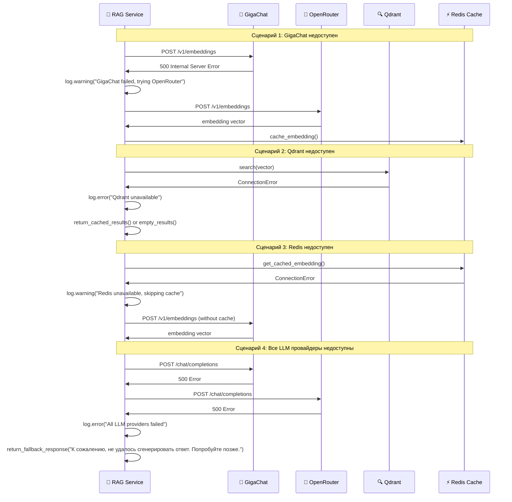
```mermaid
sequenceDiagram
    participant R as 🧠 RAG Service
    participant G as 🤖 GigaChat
    participant O as 🧠 OpenRouter
    participant Q as 🔍 Qdrant
    participant C as ⚡ Redis Cache
    
    Note over R,C: Сценарий 1: GigaChat недоступен
    R->>G: POST /v1/embeddings
    G->>R: 500 Internal Server Error
    R->>R: log.warning("GigaChat failed, trying OpenRouter")
    R->>O: POST /v1/embeddings
    O->>R: embedding vector
    R->>C: cache_embedding()
    
    Note over R,C: Сценарий 2: Qdrant недоступен
    R->>Q: search(vector)
    Q->>R: ConnectionError
    R->>R: log.error("Qdrant unavailable")
    R->>R: return_cached_results() or empty_results()
    
    Note over R,C: Сценарий 3: Redis недоступен
    R->>C: get_cached_embedding()
    C->>R: ConnectionError
    R->>R: log.warning("Redis unavailable, skipping cache")
    R->>G: POST /v1/embeddings (without cache)
    G->>R: embedding vector
    
    Note over R,C: Сценарий 4: Все LLM провайдеры недоступны
    R->>G: POST /chat/completions
    G->>R: 500 Error
    R->>O: POST /chat/completions
    O->>R: 500 Error
    R->>R: log.error("All LLM providers failed")
    R->>R: return_fallback_response("К сожалению, не удалось сгенерировать ответ. Попробуйте позже.")
```

---

## 5. Integration Flows

### 5.1 n8n Webhook интеграция

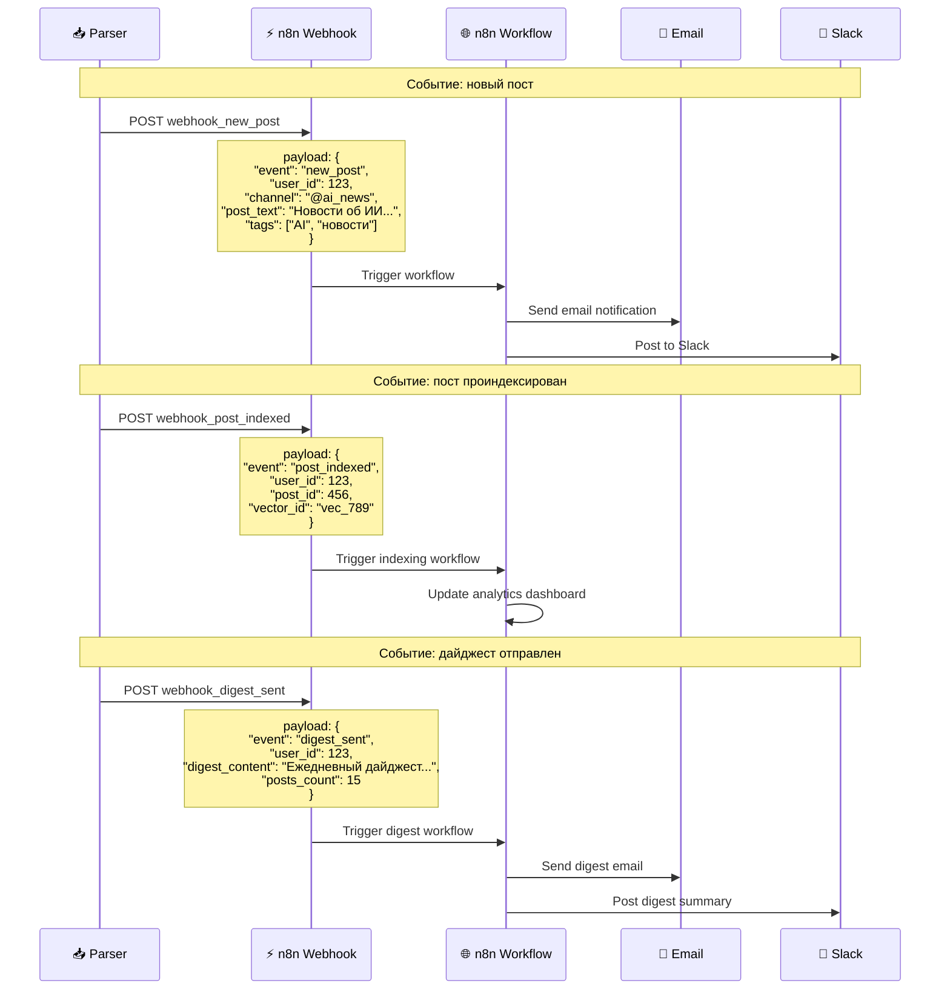
```mermaid
sequenceDiagram
    participant P as 📥 Parser
    participant N as ⚡ n8n Webhook
    participant W as 🌐 n8n Workflow
    participant E as 📧 Email
    participant S as 💬 Slack
    
    Note over P,S: Событие: новый пост
    P->>N: POST webhook_new_post
    Note over N: payload: {<br/>  "event": "new_post",<br/>  "user_id": 123,<br/>  "channel": "@ai_news",<br/>  "post_text": "Новости об ИИ...",<br/>  "tags": ["AI", "новости"]<br/>}
    N->>W: Trigger workflow
    W->>E: Send email notification
    W->>S: Post to Slack #ai-news
    
    Note over P,S: Событие: пост проиндексирован
    P->>N: POST webhook_post_indexed
    Note over N: payload: {<br/>  "event": "post_indexed",<br/>  "user_id": 123,<br/>  "post_id": 456,<br/>  "vector_id": "vec_789"<br/>}
    N->>W: Trigger indexing workflow
    W->>W: Update analytics dashboard
    
    Note over P,S: Событие: дайджест отправлен
    P->>N: POST webhook_digest_sent
    Note over N: payload: {<br/>  "event": "digest_sent",<br/>  "user_id": 123,<br/>  "digest_content": "Ежедневный дайджест...",<br/>  "posts_count": 15<br/>}
    N->>W: Trigger digest workflow
    W->>E: Send digest email
    W->>S: Post digest summary
```

### 5.2 Crawl4AI интеграция

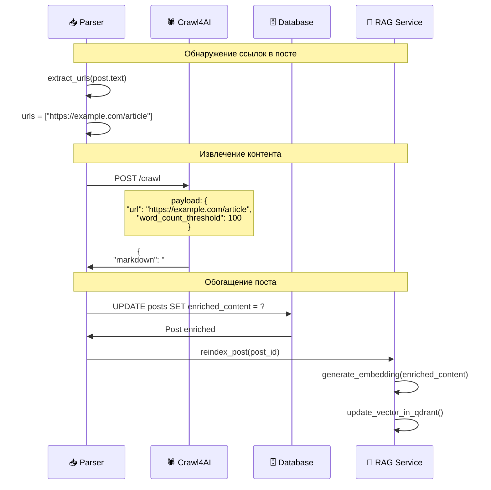
```mermaid
sequenceDiagram
    participant P as 📥 Parser
    participant C as 🕷️ Crawl4AI
    participant D as 🗄️ Database
    participant R as 🧠 RAG Service
    
    Note over P,R: Обнаружение ссылок в посте
    P->>P: extract_urls(post.text)
    P->>P: urls = ["https://example.com/article"]
    
    Note over P,R: Извлечение контента
    P->>C: POST /crawl
    Note over C: payload: {<br/>  "url": "https://example.com/article",<br/>  "word_count_threshold": 100<br/>}
    C->>P: {<br/>  "markdown": "# Заголовок статьи...",<br/>  "word_count": 500<br/>}
    
    Note over P,R: Обогащение поста
    P->>D: UPDATE posts SET enriched_content = ?
    D->>P: Post enriched
    P->>R: reindex_post(post_id)
    R->>R: generate_embedding(enriched_content)
    R->>R: update_vector_in_qdrant()
```

### 5.3 Searxng интеграция

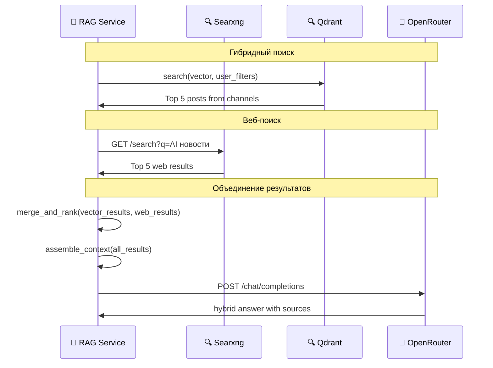
```mermaid
sequenceDiagram
    participant R as 🧠 RAG Service
    participant S as 🔍 Searxng
    participant Q as 🔍 Qdrant
    participant O as 🧠 OpenRouter
    
    Note over R,O: Гибридный поиск
    R->>Q: search(vector, user_filters)
    Q->>R: Top 5 posts from channels
    
    Note over R,O: Веб-поиск
    R->>S: GET /search?q=AI новости
    S->>R: Top 5 web results
    
    Note over R,O: Объединение результатов
    R->>R: merge_and_rank(vector_results, web_results)
    R->>R: assemble_context(all_results)
    R->>O: POST /chat/completions
    O->>R: hybrid answer with sources
```

---

## Заключение

Данные пайплайны показывают полный жизненный цикл работы системы Telegram Channel Parser Bot, включая:

- **User Journeys** - от регистрации до использования RAG
- **Background Processes** - автоматический парсинг, тегирование, индексация
- **Admin Workflows** - управление пользователями и системой
- **Error Handling** - обработка различных типов ошибок
- **Integration Flows** - взаимодействие с внешними сервисами

Все пайплайны спроектированы с учетом:
- **Отказоустойчивости** - fallback механизмы
- **Производительности** - кеширование и batch processing
- **Безопасности** - изоляция данных и валидация
- **Масштабируемости** - асинхронная обработка
- **Мониторинга** - логирование и метрики

---

> **Версия:** 3.1  
> **Дата:** 12 октября 2025  
> **Проект:** n8n-server / Telegram Channel Parser + RAG System + QR Login + Admin Panel
