# Репозиторий с первой версией проекта
https://github.com/ilyasni/t-bot-for-channels/tree/test-cleanup-fresh

# Telegram Channel Parser Bot - Системная Спецификация

> **Версия:** 3.1  
> **Дата:** 12 октября 2025  
> **Проект:** n8n-server / Telegram Channel Parser + RAG System + QR Login + Admin Panel

## Содержание

1. [Обзор системы](#1-обзор-системы)
2. [Архитектура системы](#2-архитектура-системы)
3. [Компоненты системы](#3-компоненты-системы)
4. [База данных](#4-база-данных)
5. [Интеграции](#5-интеграции)
6. [Deployment](#6-deployment)
7. [Пайплайн работы системы](#7-пайплайн-работы-системы)
8. [Мониторинг и Observability](#8-мониторинг-и-observability)

---

## 1. Обзор системы

### 1.1 Назначение и цели

**Telegram Channel Parser Bot** - это многопользовательская система для автоматического парсинга Telegram каналов с возможностью интеллектуального поиска и анализа контента через RAG (Retrieval-Augmented Generation).

**Основные цели:**
- 🤖 **Автоматизация** - регулярный парсинг каналов без ручного вмешательства
- 🔍 **Интеллектуальный поиск** - RAG-система для ответов на вопросы по контенту
- 👥 **Многопользовательский режим** - изоляция данных между пользователями
- 🔐 **Безопасная авторизация** - QR-логин через Telegram Mini App (без SMS)
- 💎 **Система подписок** - тарифные планы с различными лимитами
- 👑 **Админ-панель** - управление пользователями через Telegram Mini App

### 1.2 Ключевые возможности

#### Пользовательские функции
- **QR-авторизация** - быстрая регистрация через Telegram Mini App
- **Управление каналами** - добавление/удаление каналов для парсинга
- **RAG-поиск** - `/ask <вопрос>` для поиска ответов в постах
- **Гибридный поиск** - `/search <запрос>` (посты + веб через Searxng)
- **AI-дайджесты** - персонализированные сводки по интересам
- **Рекомендации** - `/recommend` на основе истории запросов

#### Административные функции
- **Admin Panel** - полнофункциональная SPA через Telegram Mini App
- **Управление пользователями** - роли, подписки, лимиты
- **Invite codes** - система приглашений с настройкой подписок
- **Статистика** - метрики использования и производительности

#### Технические возможности
- **Event-Driven Architecture** - асинхронная обработка событий
- **Микросервисная архитектура** - разделение на независимые сервисы
- **Vector Search** - семантический поиск через Qdrant
- **AI Integration** - GigaChat, OpenRouter, Ollama
- **Webhook Integration** - автоматизация через n8n/Flowise

### 1.3 Технологический стек

#### Backend
- **Python 3.11+** - основной язык разработки
- **FastAPI** - REST API сервер (порт 8010)
- **Telethon** - Telegram API клиент
- **python-telegram-bot** - Telegram Bot API
- **SQLAlchemy 2.0** - ORM для работы с БД
- **PostgreSQL** - основная база данных (Supabase)

#### RAG System
- **Qdrant** - векторная база данных (порт 6333)
- **Redis/Valkey** - кеширование и сессии (порт 6379)
- **GigaChat** - embeddings и LLM (через gpt2giga-proxy)
- **OpenRouter** - fallback LLM провайдер

#### Frontend
- **Telegram Mini Apps** - SPA для QR-авторизации и админ-панели
- **Tailwind CSS** - стилизация с поддержкой темной темы
- **JavaScript ES6+** - клиентская логика

#### Infrastructure
- **Docker** - контейнеризация сервисов
- **Caddy** - reverse proxy с HTTPS
- **Prometheus** - метрики и мониторинг
- **Grafana** - дашборды (опционально)

### 1.4 Архитектурные решения

#### Микросервисная архитектура
```
┌─────────────────┐    ┌─────────────────┐    ┌─────────────────┐
│   Telegram Bot  │    │   FastAPI API   │    │   RAG Service   │
│   (bot.py)      │    │   (main.py)     │    │   (rag_service) │
│   Port: -       │    │   Port: 8010    │    │   Port: 8020    │
└─────────────────┘    └─────────────────┘    └─────────────────┘
         │                       │                       │
         └───────────────────────┼───────────────────────┘
                                 │
                    ┌─────────────────┐
                    │   PostgreSQL    │
                    │   (Supabase)    │
                    └─────────────────┘
```

#### Event-Driven Processing
- **Парсинг** → **Тегирование** → **Индексация** → **RAG Ready**
- **Webhooks** для интеграции с n8n/Flowise
- **Background Tasks** для тяжелых операций

#### Security First
- **Шифрование** всех чувствительных данных (crypto_utils)
- **Изоляция** данных по пользователям
- **Rate Limiting** для защиты от злоупотреблений
- **Session Management** через Redis

---

## 2. Архитектура системы

### 2.1 Общая архитектура

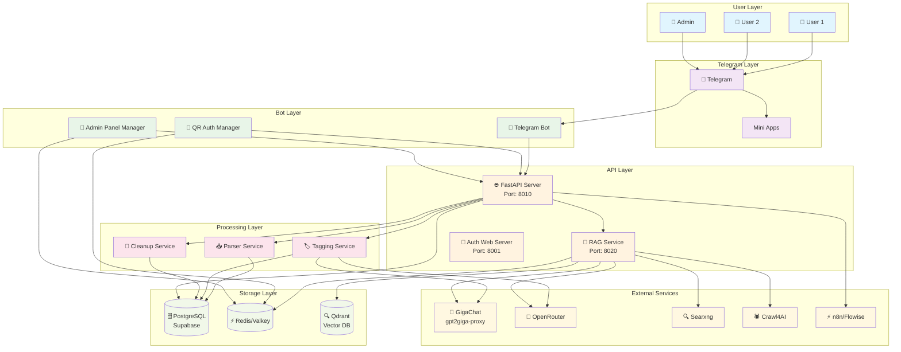

### 2.2 Event-Driven Architecture

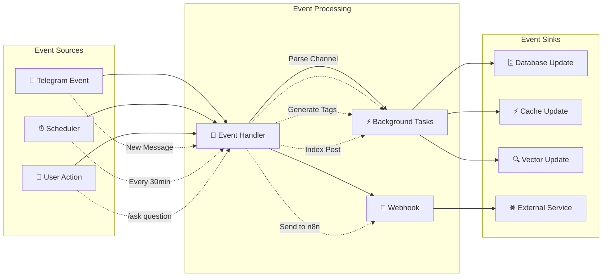

### 2.3 Data Flow

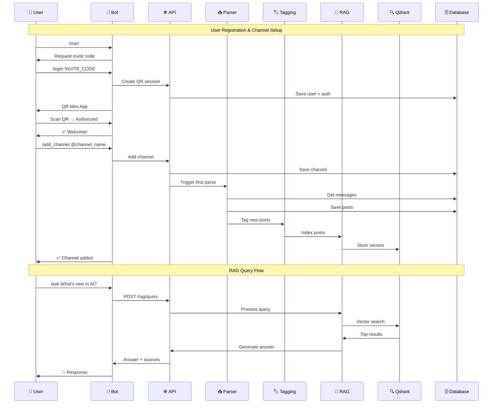

---

## 3. Компоненты системы

### 3.1 Telegram Bot Service

#### Архитектура бота

**Основные компоненты:**
- `TelegramBot` - главный класс бота
- `ConversationHandler` - управление состояниями пользователей
- `CommandHandler` - обработка команд
- `CallbackQueryHandler` - обработка inline кнопок

```python
class TelegramBot:
    def __init__(self):
        # Persistence для сохранения состояний
        persistence = PicklePersistence(filepath='data/bot_persistence.pkl')
        
        self.application = (
            Application.builder()
            .token(BOT_TOKEN)
            .persistence(persistence)
            .build()
        )
        self.setup_handlers()
```

#### Команды пользователя

| Команда | Описание | Ограничения |
|---------|----------|-------------|
| `/start` | Начало работы | Только для новых пользователей |
| `/login INVITE_CODE` | QR-авторизация | Требует валидный invite code |
| `/add_channel` | Добавить канал | Проверка лимита подписки |
| `/my_channels` | Список каналов | Показывает только свои каналы |
| `/remove_channel` | Удалить канал | Подтверждение через кнопки |
| `/ask <вопрос>` | RAG-поиск | Лимит запросов по подписке |
| `/search <запрос>` | Гибридный поиск | Посты + веб через Searxng |
| `/recommend` | Рекомендации | На основе истории запросов |
| `/digest` | Настройка дайджестов | Только для premium+ |
| `/subscription` | Информация о подписке | Показывает текущий тариф |

#### Админские команды

| Команда | Описание | Доступ |
|---------|----------|--------|
| `/admin` | Открыть Admin Panel | Только role="admin" |
| `/admin_invite` | Создать invite code | Только админы |
| `/admin_users` | Список пользователей | Только админы |
| `/admin_stats` | Статистика системы | Только админы |

#### QR-авторизация через Mini App

**Процесс авторизации:**
1. Пользователь отправляет `/login INVITE_CODE`
2. Бот создает QR сессию через `QRAuthManager`
3. Бот отправляет кнопку с `WebAppInfo`
4. Пользователь открывает Mini App
5. Пользователь сканирует QR код в Telegram
6. Система получает callback и завершает авторизацию

```python
# Пример создания QR сессии
async def create_qr_session(self, telegram_id: int, invite_code: str):
    # Создаем Telethon клиент
    client = await shared_auth_manager._create_client(telegram_id)
    await client.connect()
    
    # Генерируем QR login
    qr_login = await client.qr_login()
    
    # Сохраняем в Redis с TTL 10 минут
    session_data = {
        "telegram_id": telegram_id,
        "invite_code": invite_code,
        "qr_login": qr_login,
        "created_at": datetime.now(timezone.utc).isoformat()
    }
    
    self.redis_client.setex(
        f"qr_session:{session_id}",
        600,  # 10 минут
        json.dumps(session_data)
    )
```

### 3.2 FastAPI Server (main.py)

#### REST API Endpoints

**Аутентификация:**
- `GET /users/{user_id}/auth_status` - статус авторизации
- `POST /users/{user_id}/logout` - выход из системы
- `GET /qr-auth` - QR авторизация (Mini App)
- `GET /qr-auth-status` - статус QR сессии

**Управление каналами:**
- `GET /users/{user_id}/channels` - список каналов пользователя
- `POST /users/{user_id}/channels` - добавить канал
- `DELETE /users/{user_id}/channels/{channel_id}` - удалить канал
- `GET /users/{user_id}/channels/{channel_id}/posts` - посты канала

**Управление постами:**
- `GET /users/{user_id}/posts` - все посты пользователя
- `GET /posts/{post_id}` - конкретный пост
- `POST /posts/{post_id}/tags` - сгенерировать теги
- `DELETE /users/{user_id}/posts/cleanup` - очистка старых постов

**Админ-панель:**
- `GET /admin-panel` - SPA для админов
- `GET /api/admin/users` - список пользователей
- `POST /api/admin/user/{id}/role` - изменить роль
- `POST /api/admin/user/{id}/subscription` - изменить подписку
- `POST /api/admin/invite/create` - создать invite code

#### Request/Response схемы

```python
# Пример Pydantic модели
class ChannelCreate(BaseModel):
    channel_username: str = Field(..., min_length=1, max_length=50)
    description: Optional[str] = Field(None, max_length=500)

class ChannelResponse(BaseModel):
    id: int
    channel_username: str
    channel_title: str
    is_active: bool
    posts_count: int
    last_parsed_at: Optional[datetime]
    created_at: datetime
```

#### OpenAPI спецификация

**Автоматическая документация:**
- Swagger UI: `http://localhost:8010/docs`
- ReDoc: `http://localhost:8010/redoc`
- OpenAPI JSON: `http://localhost:8010/openapi.json`

### 3.3 Parser Service

#### Алгоритм парсинга

**Основной цикл:**
1. Получение списка аутентифицированных пользователей
2. Для каждого пользователя:
   - Получение его Telethon клиента
   - Получение активных каналов
   - Парсинг каждого канала
   - Сохранение новых постов
   - Запуск тегирования в фоне

```python
async def parse_user_channels(self, user: User, db: SessionLocal) -> int:
    """Парсить каналы конкретного пользователя"""
    client = await shared_auth_manager.get_user_client(user.telegram_id)
    
    if not client or not client.is_connected():
        return 0
    
    channels = user.get_active_channels(db)
    total_posts = 0
    
    for channel in channels:
        try:
            # Получаем последние сообщения
            messages = await client.get_messages(
                channel.channel_username,
                limit=MAX_POSTS_PER_CHANNEL
            )
            
            new_posts = await self._process_messages(messages, channel, user, db)
            total_posts += new_posts
            
        except FloodWaitError as e:
            logger.warning(f"FloodWait: {e.seconds} секунд")
            await asyncio.sleep(e.seconds)
        except Exception as e:
            logger.error(f"Ошибка парсинга канала {channel.channel_username}: {e}")
    
    return total_posts
```

#### Multi-user support

**Изоляция данных:**
- Каждый пользователь видит только свои каналы
- Фильтрация по `user_id` во всех запросах
- Отдельные Telethon клиенты для каждого пользователя

#### Rate limiting и FloodWait handling

```python
# Обработка FloodWaitError
try:
    messages = await client.get_messages(channel, limit=50)
except FloodWaitError as e:
    logger.warning(f"FloodWait: ожидание {e.seconds} секунд")
    await asyncio.sleep(e.seconds)
    # Повторная попытка
    messages = await client.get_messages(channel, limit=50)
```

#### Batch processing

**Оптимизация производительности:**
- Bulk insert для постов (до 100 за раз)
- Batch тегирование (до 10 постов)
- Асинхронная обработка тегов

### 3.4 RAG Service (микросервис)

#### Архитектура RAG

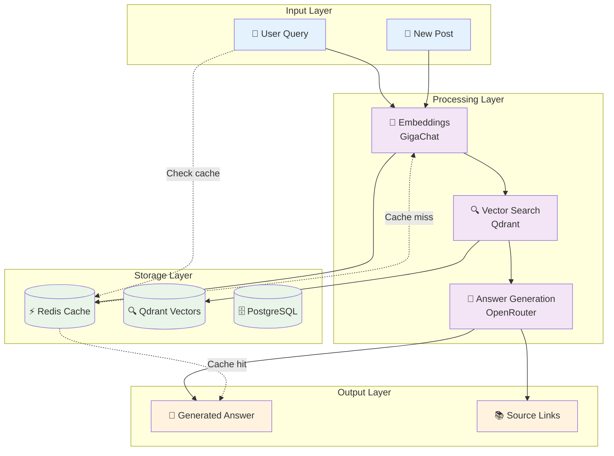

#### API Endpoints

**Индексация:**
- `POST /rag/index/post/{post_id}` - индексировать пост
- `POST /rag/index/batch` - batch индексация
- `GET /rag/index/status/{user_id}` - статус индексации

**Поиск и генерация:**
- `POST /rag/query` - RAG-запрос
- `POST /rag/search` - векторный поиск
- `GET /rag/recommend/{user_id}` - рекомендации

**Дайджесты:**
- `POST /rag/digest/settings/{user_id}` - настройки дайджестов
- `POST /rag/digest/generate/{user_id}` - генерация дайджеста

#### Алгоритмы

**Hybrid Search:**
```python
async def hybrid_search(user_id: int, query: str, top_k: int = 10):
    # 1. Векторный поиск
    query_embedding = await embeddings_service.generate(query)
    vector_results = await qdrant_search(user_id, query_embedding, top_k)
    
    # 2. Keyword search (опционально)
    keyword_results = await keyword_search(user_id, query)
    
    # 3. Объединение и re-ranking
    combined_results = merge_and_rerank(vector_results, keyword_results)
    
    return combined_results[:top_k]
```

**Context Assembly:**
```python
def assemble_context(posts: List[Post], max_tokens: int = 4000) -> str:
    """Сбор контекста из найденных постов"""
    context_parts = []
    current_tokens = 0
    
    for post in posts:
        post_text = f"[{post.channel.channel_username}] {post.text}"
        post_tokens = count_tokens(post_text)
        
        if current_tokens + post_tokens > max_tokens:
            break
            
        context_parts.append(post_text)
        current_tokens += post_tokens
    
    return "\n\n".join(context_parts)
```

### 3.5 Auth System

#### QR Login через Mini App

**Компоненты:**
- `QRAuthManager` - управление QR сессиями
- `SharedAuthManager` - управление Telethon клиентами
- Redis для shared state между контейнерами

**Безопасность:**
- TTL для QR сессий: 10 минут
- Проверка ownership после авторизации
- Шифрование чувствительных данных

#### Shared Auth Manager

```python
class SharedAuthManager:
    """Управление Telethon клиентами с master credentials"""
    
    def __init__(self):
        self.master_api_id = os.getenv("MASTER_API_ID")
        self.master_api_hash = os.getenv("MASTER_API_HASH")
        self.active_clients: Dict[int, TelegramClient] = {}
    
    async def get_user_client(self, telegram_id: int) -> Optional[TelegramClient]:
        """Получить клиент пользователя"""
        if telegram_id in self.active_clients:
            return self.active_clients[telegram_id]
        
        # Создаем новый клиент с master credentials
        client = await self._create_client(telegram_id)
        await client.connect()
        
        if client.is_connected():
            self.active_clients[telegram_id] = client
            return client
        
        return None
```

#### Session Management (Redis)

**QR Sessions:**
```python
# Сохранение QR сессии
session_data = {
    "telegram_id": telegram_id,
    "invite_code": invite_code,
    "qr_login": qr_login,
    "created_at": datetime.now(timezone.utc).isoformat()
}

redis_client.setex(
    f"qr_session:{session_id}",
    600,  # 10 минут
    json.dumps(session_data)
)
```

**Admin Sessions:**
```python
# Админ сессии с TTL 1 час
admin_data = {
    "admin_id": admin_id,
    "role": "admin",
    "created_at": datetime.now(timezone.utc).isoformat()
}

redis_client.setex(
    f"admin_session:{token}",
    3600,  # 1 час
    json.dumps(admin_data)
)
```

### 3.6 Subscription & Roles System

#### Тарифные планы

```python
SUBSCRIPTION_TIERS = {
    "free": {
        "max_channels": 3,
        "max_posts_per_day": 100,
        "rag_queries_per_day": 10,
        "ai_digest": False,
        "price_rub": 0
    },
    "trial": {
        "max_channels": 10,
        "duration_days": 7,
        "price_rub": 0
    },
    "basic": {
        "max_channels": 10,
        "max_posts_per_day": 500,
        "rag_queries_per_day": 50,
        "ai_digest": True,
        "price_rub": 500
    },
    "premium": {
        "max_channels": 50,
        "max_posts_per_day": 2000,
        "rag_queries_per_day": 200,
        "ai_digest": True,
        "price_rub": 1500
    },
    "enterprise": {
        "max_channels": 999,
        "max_posts_per_day": 99999,
        "rag_queries_per_day": 999,
        "ai_digest": True,
        "price_rub": 5000
    }
}
```

#### Invite Codes

```python
class InviteCode(Base):
    __tablename__ = "invite_codes"
    
    code = Column(String, primary_key=True)
    created_by = Column(Integer, ForeignKey("users.id"))
    expires_at = Column(DateTime, nullable=False)
    max_uses = Column(Integer, default=1)
    uses_count = Column(Integer, default=0)
    default_subscription = Column(String, default="free")
    default_trial_days = Column(Integer, default=0)
    
    @staticmethod
    def generate_code() -> str:
        """Генерирует 12-символьный код: ABC123XYZ456"""
        return ''.join(random.choices(
            string.ascii_uppercase + string.digits, k=12
        ))
```

#### Limits Enforcement

```python
async def check_subscription_limits(user: User, action: str) -> bool:
    """Проверка лимитов подписки"""
    tier = get_subscription_info(user.subscription_type)
    
    if action == "add_channel":
        if len(user.channels) >= tier["max_channels"]:
            return False
    
    elif action == "rag_query":
        # Проверка лимита запросов в день
        today_queries = get_today_rag_queries(user.id)
        if today_queries >= tier["rag_queries_per_day"]:
            return False
    
    return True
```

### 3.7 Tagging Service

#### AI-тегирование

**Провайдеры:**
- **GigaChat** (основной) - через gpt2giga-proxy
- **OpenRouter** (fallback) - бесплатные модели

**Batch Processing:**
```python
async def process_posts_batch(post_ids: List[int]):
    """Обработка пакета постов"""
    posts = db.query(Post).filter(Post.id.in_(post_ids)).all()
    
    # Подготавливаем тексты для batch обработки
    texts = [post.text for post in posts]
    
    try:
        # Пробуем GigaChat
        tags = await gigachat_tagging.batch_generate_tags(texts)
    except Exception as e:
        logger.warning(f"GigaChat failed: {e}, trying OpenRouter")
        # Fallback на OpenRouter
        tags = await openrouter_tagging.batch_generate_tags(texts)
    
    # Сохраняем теги
    for post, post_tags in zip(posts, tags):
        post.tags = post_tags
        db.commit()
```

#### Retry Mechanism

```python
async def generate_tags_with_retry(text: str, max_retries: int = 3) -> List[str]:
    """Генерация тегов с повторными попытками"""
    for attempt in range(max_retries):
        try:
            return await ai_provider.generate_tags(text)
        except Exception as e:
            if attempt == max_retries - 1:
                raise
            
            delay = 2 ** attempt  # Exponential backoff
            logger.warning(f"Attempt {attempt + 1} failed: {e}, retrying in {delay}s")
            await asyncio.sleep(delay)
```

### 3.8 Cleanup Service

#### Retention Policies

```python
async def cleanup_old_posts():
    """Очистка старых постов по retention политикам"""
    db = SessionLocal()
    
    try:
        # Получаем пользователей с индивидуальными настройками
        users = db.query(User).all()
        
        for user in users:
            retention_days = user.retention_days or DEFAULT_RETENTION_DAYS
            cutoff_date = datetime.now(timezone.utc) - timedelta(days=retention_days)
            
            # Удаляем старые посты
            old_posts = db.query(Post).filter(
                Post.user_id == user.id,
                Post.posted_at < cutoff_date
            ).all()
            
            for post in old_posts:
                # Удаляем из Qdrant
                await rag_service.delete_post_from_index(post.id)
                # Удаляем из БД
                db.delete(post)
            
            db.commit()
            logger.info(f"Cleaned {len(old_posts)} posts for user {user.telegram_id}")
    
    finally:
        db.close()
```

#### Scheduled Cleanup

```python
# Настройка расписания
CLEANUP_SCHEDULE_TIME = os.getenv("CLEANUP_SCHEDULE_TIME", "03:00")

def schedule_cleanup():
    """Планировщик очистки"""
    schedule.every().day.at(CLEANUP_SCHEDULE_TIME).do(cleanup_old_posts)
    
    while True:
        schedule.run_pending()
        time.sleep(60)  # Проверка каждую минуту
```

---

## 4. База данных

### 4.1 Схема БД

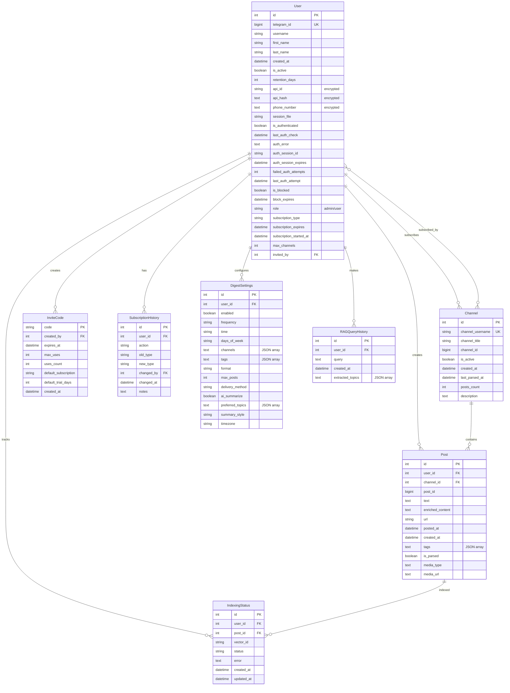

### 4.2 PostgreSQL (Supabase)

#### Connection Pooling

```python
# database.py
from sqlalchemy import create_engine
from sqlalchemy.pool import QueuePool

def get_database_url() -> str:
    """Получить URL базы данных (ТОЛЬКО PostgreSQL)"""
    database_url = os.getenv("TELEGRAM_DATABASE_URL")
    
    if not database_url:
        raise ValueError("TELEGRAM_DATABASE_URL не установлен!")
    
    if "sqlite" in database_url.lower():
        raise ValueError("SQLite НЕ поддерживается! Используйте PostgreSQL.")
    
    return database_url

# Connection pooling для production
engine = create_engine(
    get_database_url(),
    pool_size=20,           # Количество соединений в пуле
    max_overflow=10,        # Дополнительные соединения при нагрузке
    pool_pre_ping=True,     # Проверка соединений перед использованием
    pool_recycle=3600,      # Переподключение каждые 3600 секунд
    echo=False              # Отключить SQL логи в production
)
```

#### Timezone Handling

```python
from datetime import datetime, timezone
from zoneinfo import ZoneInfo

# Всегда используем UTC в БД
def to_utc(dt: datetime) -> datetime:
    """Конвертировать datetime в UTC"""
    if dt.tzinfo is None:
        return dt.replace(tzinfo=timezone.utc)
    return dt.astimezone(timezone.utc)

# Для отображения пользователю
LOCAL_TZ = ZoneInfo('Europe/Moscow')

def to_local_time(dt: datetime) -> str:
    """Конвертировать UTC в локальное время"""
    if dt.tzinfo is None:
        dt = dt.replace(tzinfo=timezone.utc)
    
    local_dt = dt.astimezone(LOCAL_TZ)
    return local_dt.isoformat()
```

#### Performance Tuning

**Индексы:**
```sql
-- Основные индексы для производительности
CREATE INDEX IF NOT EXISTS idx_users_telegram_id ON users(telegram_id);
CREATE INDEX IF NOT EXISTS idx_posts_user_id ON posts(user_id);
CREATE INDEX IF NOT EXISTS idx_posts_channel_id ON posts(channel_id);
CREATE INDEX IF NOT EXISTS idx_posts_posted_at ON posts(posted_at);
CREATE INDEX IF NOT EXISTS idx_posts_user_posted ON posts(user_id, posted_at);
CREATE INDEX IF NOT EXISTS idx_channels_username ON channels(channel_username);
CREATE INDEX IF NOT EXISTS idx_invite_codes_expires ON invite_codes(expires_at);
CREATE INDEX IF NOT EXISTS idx_subscription_history_user ON subscription_history(user_id);
```

**Query Optimization:**
```python
# Эффективные запросы
def get_user_posts_optimized(user_id: int, limit: int = 50):
    """Оптимизированный запрос постов пользователя"""
    return db.query(Post)\
        .filter(Post.user_id == user_id)\
        .order_by(Post.posted_at.desc())\
        .limit(limit)\
        .all()

# Bulk operations
def bulk_insert_posts(posts_data: List[Dict]):
    """Массовая вставка постов"""
    db.bulk_insert_mappings(Post, posts_data)
    db.commit()
```

### 4.3 Redis/Valkey

#### Кеширование

**Embeddings Cache (24h TTL):**
```python
import redis
import json
import hashlib

redis_client = redis.Redis(host='redis', port=6379, decode_responses=True)

async def get_cached_embedding(text: str) -> Optional[List[float]]:
    """Получить кешированный embedding"""
    text_hash = hashlib.md5(text.encode()).hexdigest()
    cache_key = f"embedding:{text_hash}"
    
    cached = redis_client.get(cache_key)
    if cached:
        return json.loads(cached)
    return None

async def cache_embedding(text: str, embedding: List[float]):
    """Кешировать embedding на 24 часа"""
    text_hash = hashlib.md5(text.encode()).hexdigest()
    cache_key = f"embedding:{text_hash}"
    
    redis_client.setex(
        cache_key,
        86400,  # 24 часа
        json.dumps(embedding)
    )
```

**RAG Answers Cache (1h TTL):**
```python
async def get_cached_rag_answer(user_id: int, query: str) -> Optional[str]:
    """Получить кешированный RAG ответ"""
    query_hash = hashlib.md5(f"{user_id}:{query}".encode()).hexdigest()
    cache_key = f"rag:{user_id}:{query_hash}"
    
    return redis_client.get(cache_key)

async def cache_rag_answer(user_id: int, query: str, answer: str):
    """Кешировать RAG ответ на 1 час"""
    query_hash = hashlib.md5(f"{user_id}:{query}".encode()).hexdigest()
    cache_key = f"rag:{user_id}:{query_hash}"
    
    redis_client.setex(cache_key, 3600, answer)  # 1 час
```

#### Session Management

**QR Sessions (10min TTL):**
```python
def save_qr_session(session_id: str, session_data: dict):
    """Сохранить QR сессию"""
    redis_client.setex(
        f"qr_session:{session_id}",
        600,  # 10 минут
        json.dumps(session_data)
    )

def get_qr_session(session_id: str) -> Optional[dict]:
    """Получить QR сессию"""
    data = redis_client.get(f"qr_session:{session_id}")
    return json.loads(data) if data else None
```

**Admin Sessions (1h TTL):**
```python
def save_admin_session(token: str, admin_data: dict):
    """Сохранить админ сессию"""
    redis_client.setex(
        f"admin_session:{token}",
        3600,  # 1 час
        json.dumps(admin_data)
    )
```

#### Rate Limiting

```python
def check_rate_limit(user_id: int, endpoint: str, limit: int = 10) -> bool:
    """Проверка rate limit"""
    key = f"rate:{user_id}:{endpoint}"
    current = redis_client.incr(key)
    
    if current == 1:
        redis_client.expire(key, 60)  # 1 минута
    
    return current <= limit
```

### 4.4 Qdrant (Vector DB)

#### Коллекции per-user

```python
from qdrant_client import QdrantClient, models

qdrant_client = QdrantClient(
    url=os.getenv("QDRANT_URL", "http://qdrant:6333"),
    api_key=os.getenv("QDRANT_API_KEY")
)

def create_user_collection(user_id: int):
    """Создать коллекцию для пользователя"""
    collection_name = f"user_{user_id}_posts"
    
    qdrant_client.create_collection(
        collection_name=collection_name,
        vectors_config=models.VectorParams(
            size=1536,  # Размер embedding (GigaChat)
            distance=models.Distance.COSINE
        )
    )
    
    # Создаем индексы для фильтрации
    qdrant_client.create_payload_index(
        collection_name=collection_name,
        field_name="channel_id",
        field_schema=models.PayloadSchemaType.INTEGER
    )
    
    qdrant_client.create_payload_index(
        collection_name=collection_name,
        field_name="tags",
        field_schema=models.PayloadSchemaType.KEYWORD
    )
```

#### Metadata Filters

```python
from qdrant_client.models import Filter, FieldCondition, MatchValue, MatchAny

def search_with_filters(user_id: int, query_vector: List[float], 
                        channel_id: Optional[int] = None,
                        tags: Optional[List[str]] = None):
    """Поиск с фильтрами по метаданным"""
    collection_name = f"user_{user_id}_posts"
    
    # Строим фильтр
    must_conditions = []
    
    if channel_id:
        must_conditions.append(
            FieldCondition(key="channel_id", match=MatchValue(value=channel_id))
        )
    
    if tags:
        must_conditions.append(
            FieldCondition(key="tags", match=MatchAny(any=tags))
        )
    
    query_filter = Filter(must=must_conditions) if must_conditions else None
    
    # Выполняем поиск
    results = qdrant_client.search(
        collection_name=collection_name,
        query_vector=query_vector,
        query_filter=query_filter,
        limit=10,
        score_threshold=0.7
    )
    
    return results
```

#### HNSW Configuration

```python
def optimize_collection_for_user(user_id: int):
    """Оптимизация коллекции для пользователя"""
    collection_name = f"user_{user_id}_posts"
    
    # Обновляем HNSW конфигурацию
    qdrant_client.update_collection(
        collection_name=collection_name,
        hnsw_config=models.HnswConfigDiff(
            payload_m=16,  # Размер payload в HNSW
            m=0,           # Отключаем глобальный HNSW (для per-user коллекций)
            ef_construct=200,  # Размер candidate list при построении
            full_scan_threshold=10000  # Порог для полного сканирования
        )
    )
```

#### Backup & Restore

```python
def backup_user_collection(user_id: int) -> dict:
    """Бэкап коллекции пользователя"""
    collection_name = f"user_{user_id}_posts"
    
    # Получаем все точки
    points = qdrant_client.scroll(
        collection_name=collection_name,
        limit=10000,
        with_payload=True,
        with_vectors=True
    )[0]
    
    return {
        "user_id": user_id,
        "collection_name": collection_name,
        "points": points,
        "backup_date": datetime.now(timezone.utc).isoformat()
    }

def restore_user_collection(backup_data: dict):
    """Восстановление коллекции пользователя"""
    collection_name = backup_data["collection_name"]
    
    # Создаем коллекцию
    qdrant_client.create_collection(
        collection_name=collection_name,
        vectors_config=models.VectorParams(size=1536, distance=models.Distance.COSINE)
    )
    
    # Восстанавливаем точки
    qdrant_client.upsert(
        collection_name=collection_name,
        points=backup_data["points"]
    )
```

---

## 5. Интеграции

### 5.1 Внутренние сервисы

#### gpt2giga-proxy (GigaChat → OpenAI API)

**Назначение:** Прокси для GigaChat API с OpenAI-совместимым интерфейсом

**Конфигурация:**
```yaml
# docker-compose.override.yml
gpt2giga-proxy:
  build: ./gpt2giga
  ports:
    - "8090:8090"
  environment:
    - GIGACHAT_CREDENTIALS=${GIGACHAT_CREDENTIALS}
    - GPT2GIGA_PASS_MODEL=true
    - GPT2GIGA_EMBEDDINGS=EmbeddingsGigaR
```

**Использование:**
```python
# В RAG Service
GIGACHAT_PROXY_URL = "http://gpt2giga-proxy:8090"

async def generate_embedding_gigachat(text: str) -> List[float]:
    """Генерация embedding через GigaChat"""
    async with httpx.AsyncClient() as client:
        response = await client.post(
            f"{GIGACHAT_PROXY_URL}/v1/embeddings",
            json={
                "model": "EmbeddingsGigaR",
                "input": text
            }
        )
        return response.json()["data"][0]["embedding"]
```

#### Ollama (локальные LLM)

**Назначение:** Локальная обработка чувствительных данных

**Использование:**
```python
async def process_with_ollama(text: str, model: str = "llama3.2") -> str:
    """Обработка через локальный Ollama"""
    async with httpx.AsyncClient(timeout=60.0) as client:
        response = await client.post(
            "http://ollama:11434/api/generate",
            json={
                "model": model,
                "prompt": text,
                "stream": False
            }
        )
        return response.json()["response"]
```

#### Telegram Mini Apps (WebAppInfo)

**QR Auth Mini App:**
```python
# Создание кнопки с Mini App
keyboard = InlineKeyboardMarkup([
    [InlineKeyboardButton(
        "🔐 QR Авторизация",
        web_app=WebAppInfo(url=f"{AUTH_BASE_URL}/qr-auth?session_id={session_id}")
    )]
])
```

**Admin Panel Mini App:**
```python
# Админ панель
admin_keyboard = InlineKeyboardMarkup([
    [InlineKeyboardButton(
        "👑 Admin Panel",
        web_app=WebAppInfo(url=f"{AUTH_BASE_URL}/admin-panel?token={admin_token}")
    )]
])
```

### 5.2 Внешние сервисы

#### Searxng (метапоиск)

**Назначение:** Расширение RAG контекста веб-поиском

**Интеграция:**
```python
async def search_web(query: str) -> List[str]:
    """Поиск в интернете через Searxng"""
    auth = httpx.BasicAuth(
        os.getenv("SEARXNG_USER"),
        os.getenv("SEARXNG_PASSWORD")
    )
    
    async with httpx.AsyncClient(auth=auth, timeout=10.0) as client:
        response = await client.get(
            f"{SEARXNG_URL}/search",
            params={
                "q": query,
                "format": "json",
                "categories": "general",
                "engines": "google,bing,duckduckgo"
            }
        )
        results = response.json()["results"][:5]
        return [r["content"] for r in results if r.get("content")]
```

#### Crawl4AI (веб-скрапинг)

**Назначение:** Извлечение контента из ссылок в постах

**Интеграция:**
```python
async def enrich_post_with_links(post: Post):
    """Обогащение поста контентом из ссылок"""
    urls = extract_urls(post.text)
    
    if not urls:
        return
    
    async with httpx.AsyncClient(timeout=30.0) as client:
        response = await client.post(
            "http://crawl4ai:11235/crawl",
            json={
                "url": urls[0],
                "word_count_threshold": 100
            }
        )
        content = response.json()["markdown"]
    
    # Добавляем к тексту для индексации
    post.enriched_content = f"{post.text}\n\n{content}"
    await rag_service.reindex_post(post.id)
```

#### n8n/Flowise (automation workflows)

**Назначение:** Автоматизация процессов через webhooks

**Webhook Events:**
```python
# События для отправки в n8n
WEBHOOK_EVENTS = {
    "new_post": "Новый пост добавлен",
    "post_tagged": "Пост получил AI-теги", 
    "post_indexed": "Пост индексирован в Qdrant",
    "digest_sent": "Дайджест отправлен пользователю"
}

async def notify_webhooks(event: str, data: dict):
    """Отправка события в n8n"""
    webhook_url = os.getenv(f"WEBHOOK_{event.upper()}")
    
    if webhook_url:
        async with httpx.AsyncClient() as client:
            await client.post(
                webhook_url,
                json={
                    "event": event,
                    "timestamp": datetime.now().isoformat(),
                    "data": data
                }
            )
```

#### OpenRouter (LLM API)

**Назначение:** Fallback LLM провайдер для генерации ответов

**Интеграция:**
```python
async def generate_answer_openrouter(prompt: str) -> str:
    """Генерация ответа через OpenRouter"""
    async with httpx.AsyncClient() as client:
        response = await client.post(
            "https://openrouter.ai/api/v1/chat/completions",
            headers={
                "Authorization": f"Bearer {OPENROUTER_API_KEY}",
                "Content-Type": "application/json"
            },
            json={
                "model": "google/gemini-2.0-flash-exp:free",
                "messages": [{"role": "user", "content": prompt}],
                "max_tokens": 500,
                "temperature": 0.3
            }
        )
        return response.json()["choices"][0]["message"]["content"]
```

### 5.3 Webhooks

#### События для n8n

**Payload структура:**
```python
# Пример webhook payload
{
    "event": "new_post",
    "timestamp": "2025-10-12T15:30:00Z",
    "data": {
        "user_id": 123,
        "post_id": 456,
        "channel_username": "@ai_news",
        "post_text": "Новости об ИИ...",
        "tags": ["искусственный интеллект", "новости"],
        "url": "https://t.me/ai_news/123",
        "posted_at": "2025-10-12T15:25:00Z"
    }
}
```

**Примеры workflows:**

**1. Парсинг → Анализ:**
```json
{
    "name": "Telegram Post Analysis",
    "nodes": [
        {
            "name": "Webhook",
            "type": "n8n-nodes-base.webhook",
            "parameters": {
                "path": "telegram-post",
                "httpMethod": "POST"
            }
        },
        {
            "name": "Analyze Sentiment",
            "type": "n8n-nodes-base.openAi",
            "parameters": {
                "operation": "chat",
                "model": "gpt-3.5-turbo",
                "messages": {
                    "values": [
                        {
                            "role": "system",
                            "content": "Analyze sentiment of the post"
                        },
                        {
                            "role": "user", 
                            "content": "{{ $json.data.post_text }}"
                        }
                    ]
                }
            }
        }
    ]
}
```

**2. Дайджесты → Email:**
```json
{
    "name": "Daily Digest Email",
    "nodes": [
        {
            "name": "Webhook",
            "type": "n8n-nodes-base.webhook",
            "parameters": {
                "path": "digest-sent",
                "httpMethod": "POST"
            }
        },
        {
            "name": "Send Email",
            "type": "n8n-nodes-base.emailSend",
            "parameters": {
                "to": "{{ $json.data.user_email }}",
                "subject": "Daily AI Digest",
                "text": "{{ $json.data.digest_content }}"
            }
        }
    ]
}
```

**3. Webhooks → Slack:**
```json
{
    "name": "Telegram to Slack",
    "nodes": [
        {
            "name": "Webhook",
            "type": "n8n-nodes-base.webhook"
        },
        {
            "name": "Slack",
            "type": "n8n-nodes-base.slack",
            "parameters": {
                "channel": "#ai-news",
                "text": "📱 New post: {{ $json.data.post_text }}"
            }
        }
    ]
}
```

---

## 6. Deployment

### 6.1 Docker Architecture

#### docker-compose.override.yml

```yaml
services:
  telethon:
    build:
      context: ./telethon
      dockerfile: Dockerfile.telethon
    container_name: telethon
    ports:
      - "8010:8010"  # FastAPI API
      - "8001:8001"  # Auth Web Server
    volumes:
      - ./telethon/sessions:/app/sessions
      - ./telethon/data:/app/data
      - ./telethon/logs:/app/logs
    environment:
      - TELEGRAM_DATABASE_URL=${TELEGRAM_DATABASE_URL}
      - BOT_TOKEN=${BOT_TOKEN}
      - ENCRYPTION_KEY=${ENCRYPTION_KEY}
      - MASTER_API_ID=${MASTER_API_ID}
      - MASTER_API_HASH=${MASTER_API_HASH}
      - REDIS_HOST=redis
      - REDIS_PORT=6379
    restart: unless-stopped
    networks:
      - localai_default

  rag-service:
    build:
      context: ./telethon/rag_service
      dockerfile: Dockerfile.rag
    container_name: rag-service
    ports:
      - "8020:8020"
    environment:
      - QDRANT_URL=http://qdrant:6333
      - REDIS_HOST=redis
      - GIGACHAT_PROXY_URL=http://gpt2giga-proxy:8090
    networks:
      - localai_default

  gpt2giga-proxy:
    build:
      context: ./gpt2giga
      dockerfile: Dockerfile.gpt2giga
    container_name: gpt2giga-proxy
    ports:
      - "8090:8090"
    environment:
      - GIGACHAT_CREDENTIALS=${GIGACHAT_CREDENTIALS}
    networks:
      - localai_default
```

#### Сетевая конфигурация

```yaml
networks:
  localai_default:
    driver: bridge
    ipam:
      config:
        - subnet: 172.20.0.0/16
```

#### Volumes и Persistency

```yaml
volumes:
  # Telegram sessions (критично!)
  - ./telethon/sessions:/app/sessions
  
  # База данных
  - ./telethon/data:/app/data
  
  # Логи
  - ./telethon/logs:/app/logs
  
  # Redis данные
  - redis_data:/data
  
  # Qdrant данные
  - qdrant_data:/qdrant/storage
```

### 6.2 Build Process

#### Dockerfile.telethon

```dockerfile
FROM python:3.11-slim

# Установка системных зависимостей
RUN apt-get update && apt-get install -y \
    gcc \
    g++ \
    libffi-dev \
    libssl-dev \
    && rm -rf /var/lib/apt/lists/*

# Рабочая директория
WORKDIR /app

# Копирование requirements
COPY requirements.txt .

# Установка Python зависимостей
RUN pip install --no-cache-dir -r requirements.txt

# Копирование кода
COPY . .

# Создание директорий
RUN mkdir -p sessions data logs

# Пользователь для безопасности
RUN useradd -m -u 1000 telethon && chown -R telethon:telethon /app
USER telethon

# Health check
HEALTHCHECK --interval=30s --timeout=10s --start-period=5s --retries=3 \
    CMD curl -f http://localhost:8010/health || exit 1

# Запуск
CMD ["python", "run_system.py"]
```

#### Dockerfile.rag

```dockerfile
FROM python:3.11-slim

WORKDIR /app

# Минимальные зависимости для RAG
COPY requirements.txt .
RUN pip install --no-cache-dir -r requirements.txt

# Копирование кода
COPY . .

# Создание директорий
RUN mkdir -p data logs

# Health check
HEALTHCHECK --interval=30s --timeout=10s --start-period=5s --retries=3 \
    CMD curl -f http://localhost:8020/health || exit 1

# Запуск
CMD ["uvicorn", "main:app", "--host", "0.0.0.0", "--port", "8020"]
```

#### Multi-stage builds

```dockerfile
# Стадия сборки
FROM python:3.11-slim as builder

WORKDIR /app
COPY requirements.txt .
RUN pip install --user -r requirements.txt

# Стадия production
FROM python:3.11-slim

# Копируем только установленные пакеты
COPY --from=builder /root/.local /root/.local

# Остальная конфигурация...
```

### 6.3 Production Deployment

#### Caddy Reverse Proxy

```caddy
{$TELEGRAM_AUTH_HOSTNAME:telegram-auth.produman.studio} {
    # Admin Panel Mini App
    reverse_proxy /admin-panel* telethon:8010
    reverse_proxy /api/admin/* telethon:8010
    
    # QR Auth Mini App  
    reverse_proxy /qr-auth* telethon:8010
    
    # OAuth web server (legacy)
    reverse_proxy telethon:8001
    
    # API endpoints
    reverse_proxy /users/* telethon:8010
    reverse_proxy /posts/* telethon:8010
    reverse_proxy /channels/* telethon:8010
}

# RAG Service
rag.produman.studio {
    reverse_proxy /rag/* rag-service:8020
    reverse_proxy /health rag-service:8020
}
```

#### HTTPS/SSL

```caddy
# Автоматический SSL через Let's Encrypt
{$TELEGRAM_AUTH_HOSTNAME:telegram-auth.produman.studio} {
    tls {
        dns cloudflare {$CLOUDFLARE_API_TOKEN}
    }
    
    # Остальная конфигурация...
}
```

#### Domain Routing

```caddy
# Основной домен
{$DOMAIN:produman.studio} {
    # Redirect to admin panel
    redir / /admin-panel 301
    
    # API endpoints
    reverse_proxy /api/* telethon:8010
    reverse_proxy /health telethon:8010
}

# RAG Service subdomain
rag.{$DOMAIN:produman.studio} {
    reverse_proxy rag-service:8020
}
```

#### Health Checks

```python
# В FastAPI приложении
@app.get("/health")
async def health_check():
    """Comprehensive health check"""
    checks = {
        "database": await check_database(),
        "redis": await check_redis(),
        "qdrant": await check_qdrant(),
        "gigachat_proxy": await check_gigachat()
    }
    
    all_healthy = all(checks.values())
    status = "healthy" if all_healthy else "degraded"
    
    return {
        "status": status,
        "timestamp": datetime.now().isoformat(),
        "checks": checks,
        "version": "3.1.0"
    }

async def check_database() -> bool:
    """Проверка подключения к БД"""
    try:
        db = SessionLocal()
        db.execute("SELECT 1")
        db.close()
        return True
    except:
        return False

async def check_redis() -> bool:
    """Проверка Redis"""
    try:
        redis_client.ping()
        return True
    except:
        return False

async def check_qdrant() -> bool:
    """Проверка Qdrant"""
    try:
        qdrant_client.get_collections()
        return True
    except:
        return False
```

### 6.4 Scaling Strategies

#### Horizontal Scaling для RAG

```yaml
# docker-compose.scale.yml
services:
  rag-service:
    deploy:
      replicas: 3
    environment:
      - RAG_INSTANCE_ID=${HOSTNAME}
      - LOAD_BALANCER_MODE=true
```

#### Database Read Replicas

```python
# Конфигурация для read replicas
DATABASE_READ_URL = os.getenv("TELEGRAM_DATABASE_READ_URL")
DATABASE_WRITE_URL = os.getenv("TELEGRAM_DATABASE_URL")

# Разделение read/write операций
def get_read_db():
    return create_engine(DATABASE_READ_URL)

def get_write_db():
    return create_engine(DATABASE_WRITE_URL)
```

#### Redis Cluster

```yaml
# redis-cluster.yml
services:
  redis-node-1:
    image: redis:7-alpine
    command: redis-server --cluster-enabled yes --cluster-config-file nodes.conf --cluster-node-timeout 5000 --appendonly yes
    ports:
      - "7001:7001"
      - "17001:17001"
  
  redis-node-2:
    image: redis:7-alpine
    command: redis-server --cluster-enabled yes --cluster-config-file nodes.conf --cluster-node-timeout 5000 --appendonly yes
    ports:
      - "7002:7002"
      - "17002:17002"
```

#### Load Balancing

```nginx
# nginx.conf для load balancing
upstream rag_backend {
    server rag-service-1:8020;
    server rag-service-2:8020;
    server rag-service-3:8020;
}

server {
    listen 80;
    server_name rag.produman.studio;
    
    location / {
        proxy_pass http://rag_backend;
        proxy_set_header Host $host;
        proxy_set_header X-Real-IP $remote_addr;
    }
}
```

---

## 7. Пайплайн работы системы

### 7.1 User Journey: Регистрация

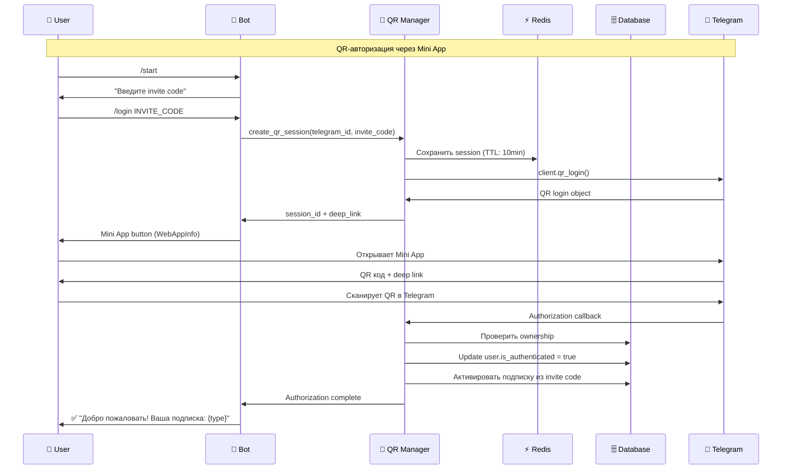

### 7.2 User Journey: Добавление канала

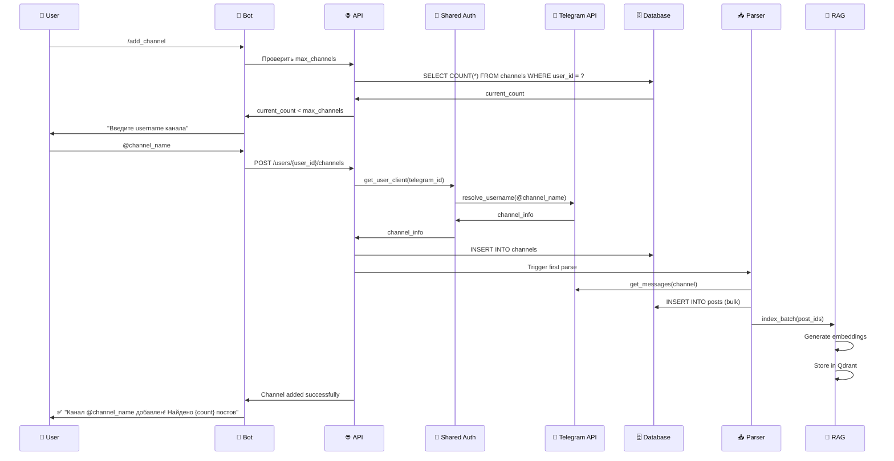

### 7.3 User Journey: RAG запрос

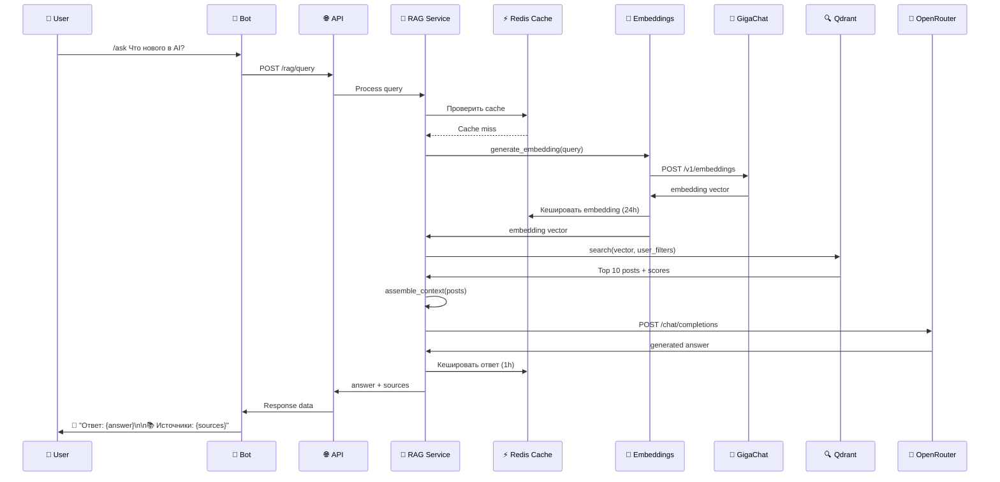

### 7.4 Background Process: Парсинг

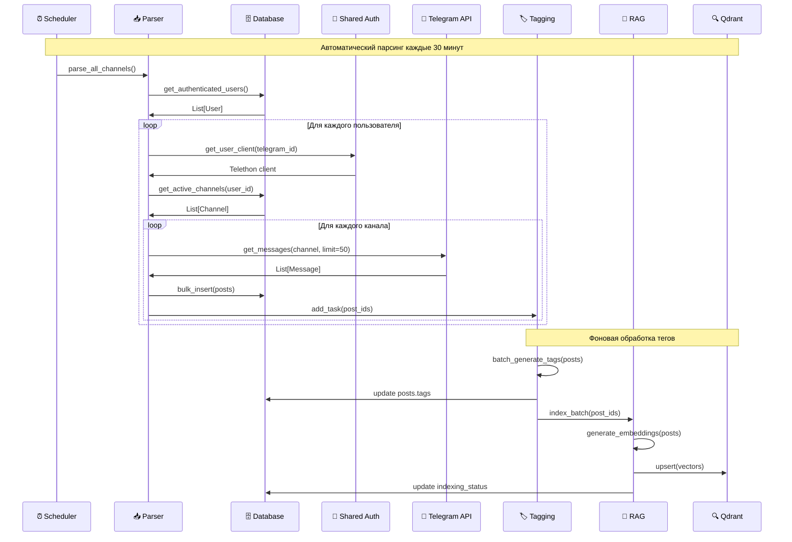

### 7.5 Admin Process: Управление пользователями

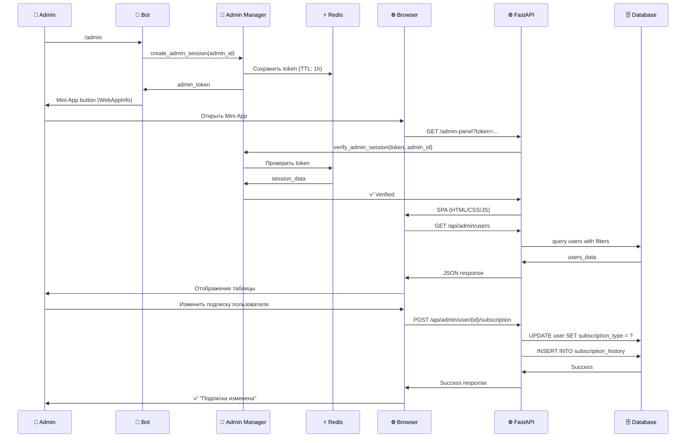

### 7.6 AI Digest Generation

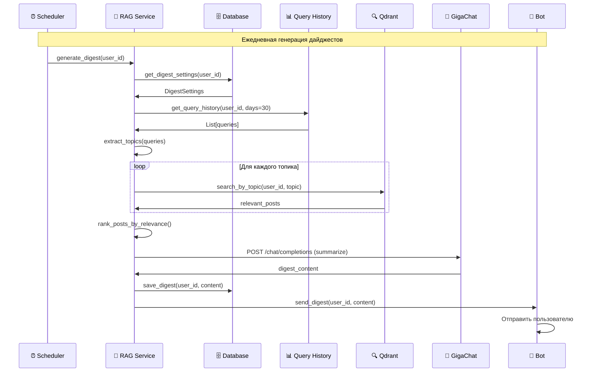

---

## 8. Мониторинг и Observability

### 8.1 Метрики (Prometheus)

#### Основные метрики

```python
from prometheus_client import Counter, Histogram, Gauge, Info

# Счетчики
rag_queries_total = Counter(
    'rag_queries_total', 
    'Total RAG queries',
    ['user_id', 'status']
)

posts_parsed_total = Counter(
    'posts_parsed_total',
    'Total posts parsed',
    ['user_id', 'channel_id']
)

embeddings_generated_total = Counter(
    'embeddings_generated_total',
    'Total embeddings generated',
    ['provider']  # gigachat, openrouter
)

# Гистограммы
rag_query_duration = Histogram(
    'rag_query_duration_seconds',
    'RAG query processing time',
    ['user_id']
)

parsing_duration = Histogram(
    'parsing_duration_seconds',
    'Channel parsing duration',
    ['user_id', 'channel_id']
)

embedding_generation_duration = Histogram(
    'embedding_generation_duration_seconds',
    'Embedding generation time',
    ['provider']
)

# Gauges
active_users = Gauge(
    'active_users_total',
    'Number of active users'
)

posts_in_queue = Gauge(
    'posts_in_queue_total',
    'Posts waiting for processing'
)

embeddings_cache_hit_rate = Gauge(
    'embeddings_cache_hit_rate',
    'Embeddings cache hit rate'
)

# Info
system_info = Info(
    'system_info',
    'System information'
)
```

#### Использование метрик

```python
# В RAG Service
@app.post("/rag/query")
async def rag_query(request: QueryRequest):
    with rag_query_duration.labels(user_id=request.user_id).time():
        # Обработка запроса
        result = await process_rag_query(request)
        
        # Увеличиваем счетчик
        rag_queries_total.labels(
            user_id=request.user_id,
            status="success"
        ).inc()
        
        return result

# В Parser Service
async def parse_channel(user_id: int, channel_id: int):
    with parsing_duration.labels(user_id=user_id, channel_id=channel_id).time():
        posts = await get_channel_messages(channel_id)
        
        posts_parsed_total.labels(
            user_id=user_id,
            channel_id=channel_id
        ).inc(len(posts))
```

#### Grafana Dashboards

**Dashboard: Telegram Parser Overview**
```json
{
  "dashboard": {
    "title": "Telegram Parser Bot - Overview",
    "panels": [
      {
        "title": "RAG Queries Rate",
        "type": "graph",
        "targets": [
          {
            "expr": "rate(rag_queries_total[5m])",
            "legendFormat": "{{status}}"
          }
        ]
      },
      {
        "title": "Posts Parsed Rate", 
        "type": "graph",
        "targets": [
          {
            "expr": "rate(posts_parsed_total[5m])",
            "legendFormat": "User {{user_id}}"
          }
        ]
      },
      {
        "title": "RAG Query Duration",
        "type": "graph",
        "targets": [
          {
            "expr": "histogram_quantile(0.95, rag_query_duration_seconds_bucket)",
            "legendFormat": "95th percentile"
          }
        ]
      },
      {
        "title": "Active Users",
        "type": "singlestat",
        "targets": [
          {
            "expr": "active_users_total"
          }
        ]
      }
    ]
  }
}
```

#### Alerting Rules

```yaml
# prometheus-alerts.yml
groups:
  - name: telegram-parser
    rules:
      - alert: HighRAGQueryLatency
        expr: histogram_quantile(0.95, rag_query_duration_seconds_bucket) > 10
        for: 5m
        labels:
          severity: warning
        annotations:
          summary: "RAG query latency is high"
          description: "95th percentile latency is {{ $value }}s"
      
      - alert: EmbeddingsCacheMissRate
        expr: embeddings_cache_hit_rate < 0.8
        for: 10m
        labels:
          severity: warning
        annotations:
          summary: "Embeddings cache hit rate is low"
          description: "Cache hit rate is {{ $value }}"
      
      - alert: ParsingErrors
        expr: rate(posts_parsed_total{status="error"}[5m]) > 0.1
        for: 2m
        labels:
          severity: critical
        annotations:
          summary: "High parsing error rate"
          description: "Error rate is {{ $value }} per second"
```

### 8.2 Логирование

#### Structured Logging

```python
import logging
import json
from datetime import datetime

# Настройка structured logging
logging.basicConfig(
    level=logging.INFO,
    format='%(asctime)s - %(name)s - %(levelname)s - %(message)s',
    handlers=[
        logging.FileHandler('logs/telethon.log'),
        logging.StreamHandler()
    ]
)

logger = logging.getLogger(__name__)

def log_event(event: str, user_id: int, **metadata):
    """Structured log для аналитики"""
    log_data = {
        "timestamp": datetime.now().isoformat(),
        "event": event,
        "user_id": user_id,
        **metadata
    }
    logger.info(json.dumps(log_data))

# Использование
log_event("rag_query", user_id=123, query="AI новости", duration_ms=450)
log_event("post_indexed", user_id=123, post_id=456, vector_id="vec_789")
log_event("channel_added", user_id=123, channel="@ai_news", posts_count=25)
```

#### Log Levels

```python
# Конфигурация уровней логирования
LOGGING_CONFIG = {
    "version": 1,
    "disable_existing_loggers": False,
    "formatters": {
        "detailed": {
            "format": "%(asctime)s - %(name)s - %(levelname)s - %(message)s"
        },
        "json": {
            "format": "%(message)s",
            "class": "pythonjsonlogger.jsonlogger.JsonFormatter"
        }
    },
    "handlers": {
        "console": {
            "class": "logging.StreamHandler",
            "level": "INFO",
            "formatter": "detailed"
        },
        "file": {
            "class": "logging.handlers.RotatingFileHandler",
            "filename": "logs/telethon.log",
            "maxBytes": 10485760,  # 10MB
            "backupCount": 5,
            "formatter": "json"
        }
    },
    "loggers": {
        "": {
            "handlers": ["console", "file"],
            "level": "INFO"
        },
        "telethon": {
            "level": "WARNING"  # Меньше логов от Telethon
        },
        "httpx": {
            "level": "WARNING"  # Меньше логов от HTTP клиента
        }
    }
}
```

#### Log Rotation

```python
from logging.handlers import RotatingFileHandler, TimedRotatingFileHandler

# По размеру файла
size_handler = RotatingFileHandler(
    'logs/telethon.log',
    maxBytes=10*1024*1024,  # 10MB
    backupCount=5
)

# По времени
time_handler = TimedRotatingFileHandler(
    'logs/telethon.log',
    when='midnight',
    interval=1,
    backupCount=30  # Хранить 30 дней
)
```

### 8.3 Tracing

#### Request Tracing

```python
import uuid
from contextvars import ContextVar

# Context variable для trace ID
trace_id_var: ContextVar[str] = ContextVar('trace_id')

def get_trace_id() -> str:
    """Получить или создать trace ID"""
    try:
        return trace_id_var.get()
    except LookupError:
        trace_id = str(uuid.uuid4())
        trace_id_var.set(trace_id)
        return trace_id

# Middleware для автоматического trace ID
@app.middleware("http")
async def add_trace_id(request: Request, call_next):
    trace_id = get_trace_id()
    response = await call_next(request)
    response.headers["X-Trace-ID"] = trace_id
    return response

# Использование в логах
def log_with_trace(level: str, message: str, **kwargs):
    trace_id = get_trace_id()
    logger.log(level, f"[{trace_id}] {message}", **kwargs)
```

#### Performance Tracing

```python
import time
from functools import wraps

def trace_performance(func):
    """Декоратор для трассировки производительности"""
    @wraps(func)
    async def wrapper(*args, **kwargs):
        start_time = time.time()
        trace_id = get_trace_id()
        
        try:
            result = await func(*args, **kwargs)
            duration = time.time() - start_time
            
            log_with_trace(
                "INFO",
                f"Function {func.__name__} completed",
                duration_ms=duration * 1000,
                status="success"
            )
            
            return result
        except Exception as e:
            duration = time.time() - start_time
            
            log_with_trace(
                "ERROR", 
                f"Function {func.__name__} failed",
                duration_ms=duration * 1000,
                error=str(e),
                status="error"
            )
            raise
    
    return wrapper

# Использование
@trace_performance
async def process_rag_query(query: str, user_id: int):
    # Обработка запроса
    pass
```

### 8.4 Health Checks

#### Comprehensive Health Check

```python
@app.get("/health")
async def health_check():
    """Comprehensive health check"""
    checks = {
        "database": await check_database(),
        "redis": await check_redis(),
        "qdrant": await check_qdrant(),
        "gigachat_proxy": await check_gigachat(),
        "telegram_api": await check_telegram_api()
    }
    
    all_healthy = all(checks.values())
    status = "healthy" if all_healthy else "degraded"
    
    return {
        "status": status,
        "timestamp": datetime.now().isoformat(),
        "checks": checks,
        "version": "3.1.0",
        "uptime": get_uptime()
    }

async def check_database() -> bool:
    """Проверка подключения к БД"""
    try:
        db = SessionLocal()
        db.execute("SELECT 1")
        db.close()
        return True
    except Exception as e:
        logger.error(f"Database check failed: {e}")
        return False

async def check_redis() -> bool:
    """Проверка Redis"""
    try:
        redis_client.ping()
        return True
    except Exception as e:
        logger.error(f"Redis check failed: {e}")
        return False

async def check_qdrant() -> bool:
    """Проверка Qdrant"""
    try:
        qdrant_client.get_collections()
        return True
    except Exception as e:
        logger.error(f"Qdrant check failed: {e}")
        return False

async def check_gigachat() -> bool:
    """Проверка GigaChat proxy"""
    try:
        async with httpx.AsyncClient(timeout=5.0) as client:
            response = await client.get(f"{GIGACHAT_PROXY_URL}/health")
            return response.status_code == 200
    except Exception as e:
        logger.error(f"GigaChat check failed: {e}")
        return False

async def check_telegram_api() -> bool:
    """Проверка Telegram API"""
    try:
        # Проверяем через shared_auth_manager
        client = await shared_auth_manager.get_master_client()
        if client and client.is_connected():
            return True
        return False
    except Exception as e:
        logger.error(f"Telegram API check failed: {e}")
        return False
```

#### Dependencies Check

```python
@app.get("/health/dependencies")
async def dependencies_check():
    """Детальная проверка зависимостей"""
    dependencies = {
        "postgresql": {
            "status": await check_database(),
            "response_time": await measure_db_response_time()
        },
        "redis": {
            "status": await check_redis(),
            "memory_usage": await get_redis_memory_usage()
        },
        "qdrant": {
            "status": await check_qdrant(),
            "collections_count": await get_qdrant_collections_count()
        },
        "gigachat_proxy": {
            "status": await check_gigachat(),
            "response_time": await measure_gigachat_response_time()
        }
    }
    
    return {
        "timestamp": datetime.now().isoformat(),
        "dependencies": dependencies
    }
```

#### Graceful Degradation

```python
# В RAG Service
async def generate_answer_with_fallback(query: str, context: str) -> str:
    """Генерация ответа с fallback"""
    try:
        # Пробуем GigaChat
        return await gigachat_generate(query, context)
    except Exception as e:
        logger.warning(f"GigaChat failed: {e}, trying OpenRouter")
        
        try:
            # Fallback на OpenRouter
            return await openrouter_generate(query, context)
        except Exception as e:
            logger.error(f"All LLM providers failed: {e}")
            
            # Последний fallback - простой ответ
            return f"Найдено {len(context.split())} слов в контексте. " \
                   f"К сожалению, не удалось сгенерировать ответ."

# В Parser Service
async def parse_with_retry(channel_id: int, max_retries: int = 3) -> List[Post]:
    """Парсинг с повторными попытками"""
    for attempt in range(max_retries):
        try:
            return await parse_channel(channel_id)
        except FloodWaitError as e:
            if attempt == max_retries - 1:
                raise
            
            logger.warning(f"FloodWait: {e.seconds}s, attempt {attempt + 1}")
            await asyncio.sleep(e.seconds)
        except Exception as e:
            if attempt == max_retries - 1:
                logger.error(f"Parsing failed after {max_retries} attempts: {e}")
                raise
            
            logger.warning(f"Parsing attempt {attempt + 1} failed: {e}")
            await asyncio.sleep(2 ** attempt)  # Exponential backoff
```

---

## 9. Текущее состояние реализации

### 9.1 Статус компонентов

| Компонент | Статус | Версия | Описание |
|-----------|--------|--------|----------|
| **Telegram Bot** | ✅ Реализован | 3.1 | Полный функционал с QR-авторизацией |
| **FastAPI Server** | ✅ Реализован | 3.1 | REST API с аутентификацией |
| **Parser Service** | ✅ Реализован | 3.1 | Автоматический парсинг каналов |
| **RAG Service** | ✅ Реализован | 3.1 | Векторный поиск и генерация ответов |
| **QR Auth Manager** | ✅ Реализован | 3.1 | QR-авторизация через Mini App |
| **Admin Panel** | ✅ Реализован | 3.1 | SPA для управления пользователями |
| **Tagging Service** | ✅ Реализован | 3.1 | AI-тегирование постов |
| **Cleanup Service** | ✅ Реализован | 3.1 | Система retention |
| **Subscription System** | ✅ Реализован | 3.1 | Роли, подписки, invite codes |

### 9.2 База данных - текущая схема

#### Реализованные таблицы

```sql
-- Основные таблицы (реализованы)
CREATE TABLE users (
    id SERIAL PRIMARY KEY,
    telegram_id BIGINT UNIQUE NOT NULL,
    username VARCHAR(255),
    first_name VARCHAR(255),
    last_name VARCHAR(255),
    created_at TIMESTAMP WITH TIME ZONE DEFAULT NOW(),
    is_active BOOLEAN DEFAULT TRUE,
    retention_days INTEGER DEFAULT 30,
    api_id VARCHAR(255),  -- encrypted
    api_hash TEXT,        -- encrypted
    phone_number TEXT,    -- encrypted
    session_file VARCHAR(255),
    is_authenticated BOOLEAN DEFAULT FALSE,
    last_auth_check TIMESTAMP WITH TIME ZONE,
    auth_error TEXT,
    auth_session_id VARCHAR(255),
    auth_session_expires TIMESTAMP WITH TIME ZONE,
    failed_auth_attempts INTEGER DEFAULT 0,
    last_auth_attempt TIMESTAMP WITH TIME ZONE,
    is_blocked BOOLEAN DEFAULT FALSE,
    block_expires TIMESTAMP WITH TIME ZONE,
    role VARCHAR(50) DEFAULT 'user',
    subscription_type VARCHAR(50) DEFAULT 'free',
    subscription_expires TIMESTAMP WITH TIME ZONE,
    subscription_started_at TIMESTAMP WITH TIME ZONE,
    max_channels INTEGER DEFAULT 3,
    invited_by INTEGER REFERENCES users(id)
);

CREATE TABLE channels (
    id SERIAL PRIMARY KEY,
    channel_username VARCHAR(255) UNIQUE NOT NULL,
    channel_title VARCHAR(255),
    channel_id BIGINT,
    is_active BOOLEAN DEFAULT TRUE,
    created_at TIMESTAMP WITH TIME ZONE DEFAULT NOW(),
    last_parsed_at TIMESTAMP WITH TIME ZONE,
    posts_count INTEGER DEFAULT 0,
    description TEXT
);

CREATE TABLE posts (
    id SERIAL PRIMARY KEY,
    user_id INTEGER REFERENCES users(id),
    channel_id INTEGER REFERENCES channels(id),
    post_id BIGINT,
    text TEXT,
    enriched_content TEXT,  -- NEW in v3.1
    url VARCHAR(500),
    posted_at TIMESTAMP WITH TIME ZONE,
    created_at TIMESTAMP WITH TIME ZONE DEFAULT NOW(),
    tags JSONB,  -- Array of strings
    is_parsed BOOLEAN DEFAULT FALSE,
    media_type VARCHAR(100),
    media_url VARCHAR(500)
);

-- RAG System таблицы (реализованы)
CREATE TABLE digest_settings (
    id SERIAL PRIMARY KEY,
    user_id INTEGER REFERENCES users(id),
    enabled BOOLEAN DEFAULT FALSE,
    frequency VARCHAR(20) DEFAULT 'daily',
    time VARCHAR(10) DEFAULT '09:00',
    days_of_week JSONB,  -- Array of strings
    channels JSONB,      -- Array of channel IDs
    tags JSONB,          -- Array of strings
    format VARCHAR(20) DEFAULT 'markdown',
    max_posts INTEGER DEFAULT 20,
    delivery_method VARCHAR(20) DEFAULT 'telegram',
    ai_summarize BOOLEAN DEFAULT TRUE,
    preferred_topics JSONB,  -- Array of strings
    summary_style VARCHAR(20) DEFAULT 'concise',
    timezone VARCHAR(50) DEFAULT 'Europe/Moscow'
);

CREATE TABLE indexing_status (
    id SERIAL PRIMARY KEY,
    user_id INTEGER REFERENCES users(id),
    post_id INTEGER REFERENCES posts(id),
    vector_id VARCHAR(255),
    status VARCHAR(20) DEFAULT 'pending',
    error TEXT,
    created_at TIMESTAMP WITH TIME ZONE DEFAULT NOW(),
    updated_at TIMESTAMP WITH TIME ZONE DEFAULT NOW()
);

CREATE TABLE rag_query_history (
    id SERIAL PRIMARY KEY,
    user_id INTEGER REFERENCES users(id),
    query TEXT NOT NULL,
    created_at TIMESTAMP WITH TIME ZONE DEFAULT NOW(),
    extracted_topics JSONB  -- Array of strings
);

-- Subscription & Roles (реализованы)
CREATE TABLE invite_codes (
    code VARCHAR(255) PRIMARY KEY,
    created_by INTEGER REFERENCES users(id),
    expires_at TIMESTAMP WITH TIME ZONE NOT NULL,
    max_uses INTEGER DEFAULT 1,
    uses_count INTEGER DEFAULT 0,
    default_subscription VARCHAR(50) DEFAULT 'free',
    default_trial_days INTEGER DEFAULT 0,
    created_at TIMESTAMP WITH TIME ZONE DEFAULT NOW()
);

CREATE TABLE subscription_history (
    id SERIAL PRIMARY KEY,
    user_id INTEGER REFERENCES users(id),
    action VARCHAR(50) NOT NULL,  -- created/upgraded/downgraded/renewed
    old_type VARCHAR(50),
    new_type VARCHAR(50),
    changed_by INTEGER REFERENCES users(id),
    changed_at TIMESTAMP WITH TIME ZONE DEFAULT NOW(),
    notes TEXT
);
```

#### Индексы (реализованы)

```sql
-- Основные индексы для производительности
CREATE INDEX idx_users_telegram_id ON users(telegram_id);
CREATE INDEX idx_users_role ON users(role);
CREATE INDEX idx_users_subscription ON users(subscription_type);
CREATE INDEX idx_posts_user_id ON posts(user_id);
CREATE INDEX idx_posts_channel_id ON posts(channel_id);
CREATE INDEX idx_posts_posted_at ON posts(posted_at);
CREATE INDEX idx_posts_user_posted ON posts(user_id, posted_at);
CREATE INDEX idx_channels_username ON channels(channel_username);
CREATE INDEX idx_invite_codes_expires ON invite_codes(expires_at);
CREATE INDEX idx_subscription_history_user ON subscription_history(user_id);
CREATE INDEX idx_indexing_status_user ON indexing_status(user_id);
CREATE INDEX idx_indexing_status_post ON indexing_status(post_id);
```

### 9.3 Сервисы - текущая реализация

#### Telegram Bot Service (`bot.py`)

**Реализованные функции:**
```python
# ✅ Реализовано
class TelegramBot:
    def __init__(self):
        self.application = Application.builder().token(BOT_TOKEN).build()
        self.setup_handlers()
    
    def setup_handlers(self):
        # Пользовательские команды
        self.application.add_handler(CommandHandler("start", start_command))
        self.application.add_handler(CommandHandler("login", login_command))
        self.application.add_handler(CommandHandler("add_channel", add_channel_command))
        self.application.add_handler(CommandHandler("my_channels", my_channels_command))
        self.application.add_handler(CommandHandler("ask", ask_command))
        self.application.add_handler(CommandHandler("search", search_command))
        self.application.add_handler(CommandHandler("recommend", recommend_command))
        self.application.add_handler(CommandHandler("digest", digest_command))
        
        # Админские команды
        self.application.add_handler(CommandHandler("admin", admin_command))
        self.application.add_handler(CommandHandler("admin_invite", admin_invite_command))
```

#### FastAPI Server (`main.py`)

**Реализованные endpoints:**
```python
# ✅ Реализовано
@app.get("/users/{user_id}/auth_status")
@app.post("/users/{user_id}/logout")
@app.get("/qr-auth")  # Mini App
@app.get("/qr-auth-status")
@app.get("/users/{user_id}/channels")
@app.post("/users/{user_id}/channels")
@app.delete("/users/{user_id}/channels/{channel_id}")
@app.get("/users/{user_id}/posts")
@app.get("/posts/{post_id}")
@app.post("/posts/{post_id}/tags")
@app.get("/admin-panel")  # Mini App
@app.get("/api/admin/users")
@app.post("/api/admin/user/{id}/role")
@app.post("/api/admin/user/{id}/subscription")
@app.post("/api/admin/invite/create")
```

#### RAG Service (`rag_service/main.py`)

**Реализованные endpoints:**
```python
# ✅ Реализовано
@app.post("/rag/index/post/{post_id}")
@app.post("/rag/index/batch")
@app.get("/rag/index/status/{user_id}")
@app.post("/rag/query")
@app.post("/rag/search")
@app.get("/rag/recommend/{user_id}")
@app.post("/rag/digest/settings/{user_id}")
@app.post("/rag/digest/generate/{user_id}")
@app.get("/rag/health")
```

#### QR Auth Manager (`qr_auth_manager.py`)

**Реализованные функции:**
```python
# ✅ Реализовано
class QRAuthManager:
    async def create_qr_session(self, telegram_id: int, invite_code: str):
        # Создание QR сессии с TTL 10 минут
        pass
    
    async def _poll_authorization(self, session_id: str, qr_login):
        # Polling авторизации
        pass
    
    async def _finalize_authorization(self, session_id: str):
        # Завершение авторизации
        pass
```

#### Admin Panel Manager (`admin_panel_manager.py`)

**Реализованные функции:**
```python
# ✅ Реализовано
class AdminPanelManager:
    def create_admin_session(self, admin_id: int) -> Optional[str]:
        # Создание админ сессии с TTL 1 час
        pass
    
    def verify_admin_session(self, token: str, admin_id: int) -> bool:
        # Проверка админ сессии
        pass
```

### 9.4 Docker конфигурация

#### Реализованные сервисы

```yaml
# docker-compose.override.yml (реализовано)
services:
  telethon:
    build: ./telethon
    ports:
      - "8010:8010"  # FastAPI API
      - "8001:8001"  # Auth Web Server
    volumes:
      - ./telethon/sessions:/app/sessions
      - ./telethon/data:/app/data
      - ./telethon/logs:/app/logs
    environment:
      - TELEGRAM_DATABASE_URL=${TELEGRAM_DATABASE_URL}
      - BOT_TOKEN=${BOT_TOKEN}
      - ENCRYPTION_KEY=${ENCRYPTION_KEY}
      - MASTER_API_ID=${MASTER_API_ID}
      - MASTER_API_HASH=${MASTER_API_HASH}
      - REDIS_HOST=redis
      - REDIS_PORT=6379
    networks:
      - localai_default

  rag-service:
    build: ./telethon/rag_service
    ports:
      - "8020:8020"
    environment:
      - QDRANT_URL=http://qdrant:6333
      - REDIS_HOST=redis
      - GIGACHAT_PROXY_URL=http://gpt2giga-proxy:8090
    networks:
      - localai_default

  gpt2giga-proxy:
    build: ./gpt2giga
    ports:
      - "8090:8090"
    environment:
      - GIGACHAT_CREDENTIALS=${GIGACHAT_CREDENTIALS}
    networks:
      - localai_default
```

### 9.5 Интеграции - текущий статус

| Интеграция | Статус | Конфигурация |
|------------|--------|--------------|
| **PostgreSQL** | ✅ Активна | Supabase через `TELEGRAM_DATABASE_URL` |
| **Redis/Valkey** | ✅ Активна | `redis:6379` для кеширования и сессий |
| **Qdrant** | ✅ Активна | `qdrant:6333` для векторного поиска |
| **GigaChat** | ✅ Активна | Через `gpt2giga-proxy:8090` |
| **OpenRouter** | ✅ Активна | Fallback LLM провайдер |
| **Searxng** | ✅ Активна | Веб-поиск для гибридного RAG |
| **Crawl4AI** | ✅ Активна | Обогащение постов ссылками |
| **n8n/Flowise** | ✅ Активна | Webhooks для автоматизации |

### 9.6 Переменные окружения

#### Реализованные переменные

```bash
# Основные (реализованы)
TELEGRAM_DATABASE_URL=postgresql://postgres:password@db:5432/postgres
BOT_TOKEN=1234567890:ABC...
ENCRYPTION_KEY=your-32-char-encryption-key
MASTER_API_ID=12345678
MASTER_API_HASH=abcdef1234567890abcdef1234567890

# Redis
REDIS_HOST=redis
REDIS_PORT=6379

# Qdrant
QDRANT_URL=http://qdrant:6333
QDRANT_API_KEY=your-qdrant-api-key

# GigaChat
GIGACHAT_CREDENTIALS=your-gigachat-credentials

# OpenRouter
OPENROUTER_API_KEY=your-openrouter-api-key

# Searxng
SEARXNG_URL=https://searxng.produman.studio
SEARXNG_USER=your-username
SEARXNG_PASSWORD=your-password

# Webhooks
WEBHOOK_NEW_POST=https://n8n.produman.studio/webhook/telegram-new-post
WEBHOOK_POST_TAGGED=https://n8n.produman.studio/webhook/telegram-post-tagged
WEBHOOK_POST_INDEXED=https://n8n.produman.studio/webhook/telegram-post-indexed
WEBHOOK_DIGEST_SENT=https://n8n.produman.studio/webhook/telegram-digest-sent
```

### 9.7 Файловая структура - текущее состояние

```
telethon/
├── README.md                    # ✅ Обновлен
├── TESTING_GUIDE.md            # ✅ Существует
├── QUICK_REFERENCE.md          # ✅ Существует
├── docs/
│   ├── SYSTEM_SPECIFICATION.md # ✅ Создан (2700+ строк)
│   ├── SYSTEM_PIPELINE.md      # ✅ Создан (700+ строк)
│   └── [остальная документация]
├── rag_service/
│   ├── main.py                 # ✅ RAG микросервис
│   ├── vector_db.py            # ✅ Qdrant клиент
│   ├── embeddings.py           # ✅ Embeddings генерация
│   ├── search.py               # ✅ Гибридный поиск
│   ├── generator.py            # ✅ RAG генерация
│   └── requirements.txt        # ✅ Зависимости
├── bot.py                      # ✅ Telegram Bot
├── main.py                     # ✅ FastAPI Server
├── parser_service.py           # ✅ Парсер каналов
├── qr_auth_manager.py          # ✅ QR авторизация
├── admin_panel_manager.py      # ✅ Админ панель
├── shared_auth_manager.py      # ✅ Telethon клиенты
├── subscription_config.py     # ✅ Тарифные планы
├── models.py                   # ✅ SQLAlchemy модели
├── database.py                 # ✅ Подключение к БД
├── tagging_service.py          # ✅ AI тегирование
├── cleanup_service.py          # ✅ Система retention
├── auth.py                     # ✅ Базовая аутентификация
├── secure_auth_manager.py      # ✅ Безопасная аутентификация
├── auth_web_server.py          # ✅ Web сервер OAuth
├── user_auth_manager.py        # ✅ Управление пользователями
├── crypto_utils.py             # ✅ Шифрование данных
├── run_system.py               # ✅ Запуск системы
├── requirements.txt            # ✅ Зависимости
├── Dockerfile.telethon         # ✅ Docker образ
├── sessions/                   # ✅ Telegram сессии
├── data/                       # ✅ База данных
└── logs/                       # ✅ Логи приложения
```

### 9.8 Статус разработки по версиям

| Версия | Дата | Основные изменения |
|--------|------|-------------------|
| **3.1** | 12.10.2025 | ✅ QR Login, Admin Panel, RAG System, Subscription System |
| **2.2** | 11.10.2025 | ✅ RAG System, AI-дайджесты, интеграции |
| **2.1** | 10.10.2025 | ✅ Docker интеграция, dev.sh скрипты |
| **2.0** | 09.10.2025 | ✅ Микросервисная архитектура |
| **1.0** | 08.10.2025 | ✅ Базовый парсер каналов |

---

> **Продолжение следует...**  
> Следующие разделы: Security, Performance, Testing, Troubleshooting, API Reference, Code Examples
