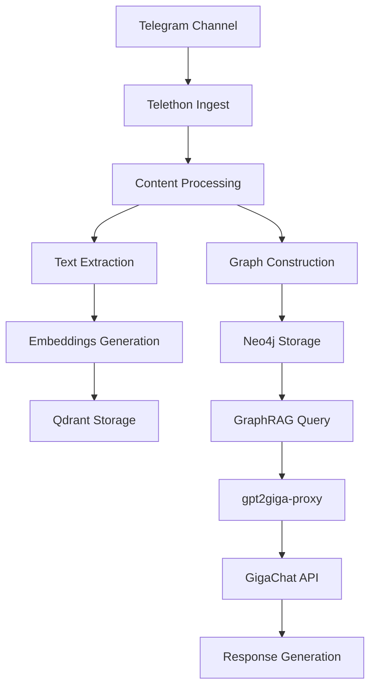

# System Specification v3.2

## Обзор системы

Telegram Assistant v3.2 — это архитектурно-ориентированная система для парсинга и анализа Telegram каналов с использованием GraphRAG, Neo4j, и GigaChat через gpt2giga-proxy.

## Архитектурные принципы

### Приоритеты (в порядке важности)
1. **Security** — безопасность данных и аутентификация
2. **Observability** — мониторинг, логирование, метрики
3. **Multi-tenancy** — изоляция пользователей и данных

### Ограничения
- **Не пишем прод-код без явного запроса**
- **Фокус на архитектуре, пайплайнах, рефакторинге**
- **Поддержка существующего кода**

## Технологический стек

### Core Services
- **API**: FastAPI + Python 3.11
- **Worker**: Celery + Redis
- **Database**: PostgreSQL (Supabase) + Neo4j + Qdrant
- **Cache**: Redis
- **Proxy**: Caddy (SSL/TLS termination)

### AI & ML
- **Primary**: GigaChat через gpt2giga-proxy
- **Fallback**: OpenRouter (бесплатные модели)
- **Embeddings**: EmbeddingsGigaR
- **RAG**: LangChain + Qdrant

### Observability
- **Metrics**: Prometheus + Grafana
- **Logging**: Structured JSON logs
- **Tracing**: OpenTelemetry (планируется)
- **Alerts**: Prometheus AlertManager

## GraphRAG Integration Flow



### Компоненты GraphRAG

1. **Content Ingestion**
   - Telethon для получения сообщений
   - Обработка медиа и текста
   - Извлечение метаданных

2. **Vector Storage (Qdrant)**
   - Embeddings для семантического поиска
   - Индексация по содержимому
   - Масштабируемое хранение векторов

3. **Graph Storage (Neo4j)**
   - Узлы: каналы, пользователи, сообщения
   - Связи: подписки, взаимодействия, темы
   - Cypher запросы для навигации

4. **AI Processing**
   - gpt2giga-proxy для OpenAI-compatible API
   - GigaChat для генерации и embeddings
   - LangChain для оркестрации

## gpt2giga Proxy Architecture

### Конфигурация
```yaml
gpt2giga-proxy:
  image: ghcr.io/ai-forever/gpt2giga:latest
  environment:
    GIGACHAT_CREDENTIALS: ${GIGACHAT_CREDENTIALS}
    GIGACHAT_SCOPE: GIGACHAT_API_PERS
    GIGACHAT_MODEL: GigaChat
    GPT2GIGA_EMBEDDINGS: EmbeddingsGigaR
```

### Интеграция
- **Worker/API**: `OPENAI_API_BASE=http://gpt2giga-proxy:8090/v1`
- **Authentication**: GigaChat credentials через proxy
- **Models**: GigaChat для генерации, EmbeddingsGigaR для векторов

## SSL/TLS Configuration

### Caddy Configuration
```caddyfile
api.produman.studio {
    tls {$CADDY_TLS_EMAIL}
    
    # Security headers
    header {
        Strict-Transport-Security "max-age=31536000; includeSubDomains; preload"
        X-Content-Type-Options nosniff
        X-Frame-Options DENY
        X-XSS-Protection "1; mode=block"
        -Server
    }
    
    # Protected metrics
    @metrics path /metrics
    handle @metrics {
        reverse_proxy api:8000
    }
}
```

### SSL Monitoring
- **Certificate expiry**: `ssl_cert_not_after{domain="api.produman.studio"}`
- **Alert threshold**: 7 days before expiry
- **Auto-renewal**: Let's Encrypt через Caddy

## Neo4j Integration

### Connection Configuration
```bash
NEO4J_URI=neo4j://neo4j:7687
NEO4J_USER=neo4j
NEO4J_PASSWORD=<generated_secure_password>
NEO4J_AUTH=${NEO4J_USER}/${NEO4J_PASSWORD}
```

### Health Monitoring
- **Health endpoint**: `http://neo4j-health:7475/health`
- **Metrics endpoint**: `http://neo4j-health:7475/metrics`
- **Connection check**: `cypher-shell -a neo4j://neo4j:7687`

### Graph Schema
```cypher
// Channels
CREATE (c:Channel {id: $channel_id, title: $title, username: $username})

// Users
CREATE (u:User {id: $user_id, username: $username})

// Messages
CREATE (m:Message {id: $message_id, text: $text, date: $date})

// Relationships
CREATE (c)-[:HAS_MESSAGE]->(m)
CREATE (u)-[:SUBSCRIBED_TO]->(c)
```

## Observability Stack

### Prometheus Metrics
- **HTTP**: `http_requests_total`, `http_request_duration_seconds`
- **Neo4j**: `neo4j_connections_active`, `neo4j_query_duration_seconds`
- **Worker**: `worker_tasks_processed_total`, `worker_queue_size`
- **SSL**: `ssl_cert_not_after`
- **RAG**: `rag_queries_total`, `rag_processing_duration_seconds`

### Grafana Dashboards
1. **System Overview** (`telegram-assistant-overview.json`)
   - HTTP metrics, Redis, PostgreSQL
   - System health и performance

2. **GraphRAG Overview** (`graphrag-overview.json`)
   - Neo4j nodes/relationships
   - RAG processing latency
   - SSL certificate expiry

### Alerting Rules
- **SSL**: Certificate expiry warnings
- **Neo4j**: Connection failures, high latency
- **Worker**: Queue backlog, task failures
- **RAG**: Processing latency, query failures

## RLS Verification Checklist

### PostgreSQL RLS
```sql
-- Проверка включения RLS
SELECT schemaname, tablename, rowsecurity 
FROM pg_tables 
WHERE schemaname = 'public' AND rowsecurity = true;

-- Тест с anon ролью
SET ROLE anon;
SELECT * FROM channels LIMIT 1;
```

### Neo4j Security
- **Authentication**: Username/password
- **Authorization**: Role-based access (планируется)
- **Network**: Internal Docker network only

## Environment Configuration

### Critical Variables
```bash
# SSL/TLS
CADDY_TLS_EMAIL=hello@ilyasni.com

# Neo4j
NEO4J_URI=neo4j://neo4j:7687
NEO4J_AUTH=neo4j/<generated>

# GigaChat
GIGACHAT_CREDENTIALS=N2MwNTA0...
OPENAI_API_BASE=http://gpt2giga-proxy:8090/v1

# Security
JWT_SECRET=<generated>
POSTGRES_PASSWORD=<generated>
```

### Secrets Management
- **Generation**: `scripts/generate_secrets.sh`
- **Storage**: `.env` file (не в git)
- **Production**: Docker secrets (рекомендуется)

## Deployment Architecture

### Docker Compose Services
```yaml
services:
  # Core infrastructure
  - supabase-db (PostgreSQL)
  - redis
  - qdrant
  - neo4j
  
  # AI services
  - gpt2giga-proxy
  
  # Application services
  - api (FastAPI)
  - worker (Celery)
  - telethon-ingest
  
  # Observability
  - prometheus
  - grafana
  - neo4j-health
  
  # Proxy
  - caddy
```

### Network Security
- **Internal**: Docker network для сервисов
- **External**: Caddy как единственная точка входа
- **SSL**: Let's Encrypt автоматическое обновление

## Performance Considerations

### Scaling
- **Horizontal**: Multiple worker instances
- **Vertical**: Resource limits в Docker
- **Database**: Connection pooling, read replicas

### Monitoring
- **Latency**: p95 для всех операций
- **Throughput**: Requests per second
- **Resource**: CPU, memory, disk usage

## Security Best Practices

### Data Protection
- **Encryption**: TLS для всех соединений
- **Secrets**: Secure generation и rotation
- **Access**: Role-based permissions

### Network Security
- **Firewall**: Minimal exposed ports
- **Proxy**: Caddy с security headers
- **Internal**: Service-to-service в Docker network

## Troubleshooting

### Common Issues
1. **SSL handshake errors**: Проверить Caddy конфигурацию
2. **Neo4j auth failures**: Проверить NEO4J_AUTH переменную
3. **GigaChat errors**: Проверить gpt2giga-proxy статус

### Health Checks
```bash
# SSL
curl -Ik https://api.produman.studio/health

# Neo4j
curl http://localhost:7475/health

# gpt2giga
curl http://localhost:8090/v1/models
```

## Roadmap

### v3.3 (Planned)
- OpenTelemetry tracing
- Advanced Neo4j authorization
- Performance optimizations
- Additional AI providers

### v4.0 (Future)
- Microservices decomposition
- Event-driven architecture
- Advanced analytics
- Multi-region deployment
