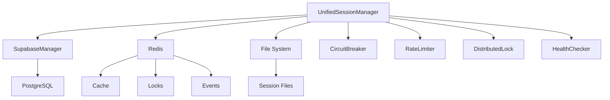

# Context7 Best Practices в Telegram Assistant

## Обзор

Этот документ описывает применение Context7 best practices в проекте Telegram Assistant, особенно в компоненте `UnifiedSessionManager`.

## Принципы Context7

### 1. Observability (Наблюдаемость)

#### Метрики (Prometheus)
- **Счетчики**: Количество событий (transitions, locks, errors)
- **Гистограммы**: Время выполнения операций
- **Gauges**: Текущее состояние системы

```python
# Примеры метрик
session_state_transitions_total
session_get_client_latency_seconds
circuit_breaker_state
```

#### Логирование (Structured Logging)
- Использование `structlog` для структурированных логов
- Контекстная информация в каждом логе
- Уровни логирования: DEBUG, INFO, WARNING, ERROR, CRITICAL

```python
logger.info(
    "Session state transition",
    tenant_id=tenant_id,
    app_id=app_id,
    from_state=from_state,
    to_state=to_state,
    reason=reason
)
```

#### Трассировка (Distributed Tracing)
- OpenTelemetry для трассировки запросов
- Корреляция событий между сервисами
- Время выполнения операций

### 2. Resilience (Устойчивость)

#### Circuit Breaker
- Защита от каскадных сбоев
- Автоматическое восстановление
- Мониторинг состояния

```python
circuit_breaker = CircuitBreaker(
    failure_threshold=5,
    recovery_timeout=60,
    expected_exception=TelegramError
)
```

#### Retry Logic
- Экспоненциальная задержка
- Jitter для предотвращения thundering herd
- Максимальное количество попыток

#### Timeout Management
- Таймауты для всех внешних вызовов
- Graceful degradation при превышении таймаутов

### 3. Security (Безопасность)

#### Secret Management
- Хранение секретов в переменных окружения
- Использование `api_key_alias` вместо прямого хранения
- Валидация секретов при старте

#### Row Level Security (RLS)
- Политики доступа на уровне базы данных
- Изоляция данных по `tenant_id`
- Аудит доступа

#### Input Validation
- Валидация всех входных данных
- Санитизация пользовательского ввода
- Защита от injection атак

### 4. Scalability (Масштабируемость)

#### Distributed Locks
- Взаимное исключение в распределенной среде
- Heartbeat для предотвращения deadlock
- Автоматическое освобождение при сбоях

```python
async with DistributedLock(redis, f"session:{tenant_id}:{app_id}"):
    # Критическая секция
    pass
```

#### Rate Limiting
- Контроль частоты запросов
- Защита от злоупотреблений
- Справедливое распределение ресурсов

#### Caching
- Redis для кэширования
- TTL для автоматического истечения
- Инвалидация при изменениях

### 5. Maintainability (Поддерживаемость)

#### Single Responsibility Principle
- Каждый класс имеет одну ответственность
- Четкое разделение concerns
- Легкость тестирования

#### Dependency Injection
- Внедрение зависимостей через конструктор
- Легкость мокирования для тестов
- Слабая связанность компонентов

#### Configuration Management
- Централизованная конфигурация
- Валидация настроек при старте
- Поддержка разных окружений

### 6. Testing (Тестирование)

#### Unit Tests
- Покрытие всех публичных методов
- Мокирование внешних зависимостей
- Тестирование edge cases

#### Integration Tests
- Тестирование взаимодействия компонентов
- Использование тестовой базы данных
- Проверка end-to-end сценариев

#### Property-Based Testing
- Тестирование инвариантов
- Автоматическая генерация тестовых данных
- Выявление неочевидных багов

### 7. Monitoring (Мониторинг)

#### Health Checks
- Проверка состояния компонентов
- Graceful shutdown
- Readiness и liveness probes

#### Alerting
- Критические метрики
- Пороговые значения
- Уведомления в Slack/email

#### Dashboards
- Grafana дашборды
- Визуализация метрик
- Исторические данные

## Реализация в UnifiedSessionManager

### Архитектура



### Ключевые компоненты

1. **UnifiedSessionManager**: Основной менеджер сессий
2. **SupabaseManager**: Взаимодействие с Supabase
3. **CircuitBreaker**: Защита от сбоев Telegram API
4. **RateLimiter**: Контроль частоты запросов
5. **DistributedLock**: Взаимное исключение
6. **HealthChecker**: Проверка состояния системы

### Метрики

- `session_state_transitions_total`: Переходы состояний сессий
- `session_get_client_latency_seconds`: Время получения клиента
- `circuit_breaker_state`: Состояние circuit breaker
- `rate_limit_allowed_total`: Разрешенные запросы
- `distributed_lock_acquired_total`: Полученные блокировки
- `session_health_checks_total`: Health checks

### Логирование

```python
logger.info(
    "Session operation completed",
    tenant_id=tenant_id,
    app_id=app_id,
    operation=operation,
    duration=duration,
    success=success
)
```

### Обработка ошибок

```python
try:
    result = await operation()
except TelegramError as e:
    logger.error(
        "Telegram API error",
        error=str(e),
        tenant_id=tenant_id,
        app_id=app_id
    )
    raise
except Exception as e:
    logger.error(
        "Unexpected error",
        error=str(e),
        tenant_id=tenant_id,
        app_id=app_id
    )
    raise
```

## Заключение

Context7 best practices обеспечивают:

- **Надежность**: Circuit breaker, retry logic, graceful degradation
- **Безопасность**: RLS, secret management, input validation
- **Масштабируемость**: Distributed locks, rate limiting, caching
- **Наблюдаемость**: Метрики, логи, трассировка
- **Поддерживаемость**: Чистая архитектура, тестирование, документация

Эти принципы делают систему устойчивой к сбоям, безопасной, масштабируемой и легко поддерживаемой.