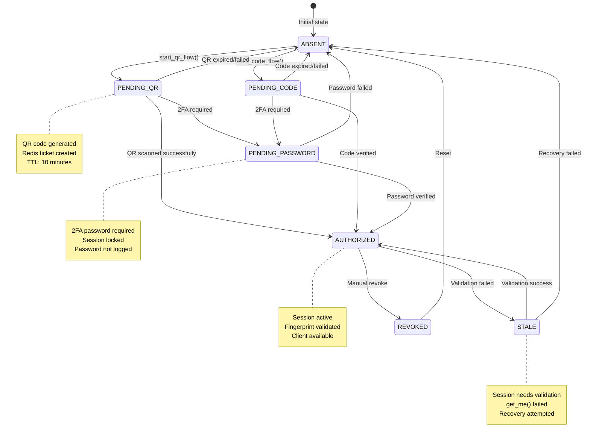

# State Machine Diagram - UnifiedSessionManager

## Mermaid Diagram

## State Descriptions

### ABSENT
- **Description**: Session not found or not initialized
- **Actions**: Start QR flow or code flow
- **Transitions**: → PENDING_QR, → PENDING_CODE

### PENDING_QR
- **Description**: Waiting for QR code scan
- **Actions**: 
  - Generate QR code
  - Create Redis ticket
  - Set TTL (10 minutes)
- **Transitions**: → PENDING_PASSWORD (2FA), → AUTHORIZED (success), → ABSENT (expired)

### PENDING_CODE
- **Description**: Waiting for SMS code verification
- **Actions**:
  - Send SMS code
  - Wait for verification
- **Transitions**: → PENDING_PASSWORD (2FA), → AUTHORIZED (success), → ABSENT (expired)

### PENDING_PASSWORD
- **Description**: Waiting for 2FA password
- **Actions**:
  - Lock session
  - Wait for password
  - Validate password
- **Transitions**: → AUTHORIZED (success), → ABSENT (failed)

### AUTHORIZED
- **Description**: Session is authorized and active
- **Actions**:
  - Validate session periodically
  - Provide client access
  - Update activity timestamp
- **Transitions**: → STALE (validation failed), → REVOKED (manual)

### STALE
- **Description**: Session is stale and needs validation
- **Actions**:
  - Attempt recovery
  - Validate with get_me()
  - Update fingerprint
- **Transitions**: → AUTHORIZED (recovery success), → ABSENT (recovery failed)

### REVOKED
- **Description**: Session has been revoked
- **Actions**:
  - Remove session file
  - Clear Redis data
  - Update database
- **Transitions**: → ABSENT (reset)

## Transition Reasons

### QR Flow
- `qr_started`: QR flow initiated
- `qr_scanned`: QR code scanned
- `password_required`: 2FA password required
- `password_verified`: 2FA password verified
- `authorization_success`: Authorization completed

### Validation
- `validation_failed`: Session validation failed
- `validation_success`: Session validation successful
- `session_expired`: Session expired

### Manual Actions
- `manual_revoke`: Session manually revoked
- `api_error`: Telegram API error

## Business Rules

1. **Single Source of Truth**: SQLiteSession files in `/app/sessions/<tenant>/<app>.session`
2. **Fingerprint Validation**: SHA256:size:mtime for tamper detection
3. **Lock Coordination**: Redis locks with heartbeat for concurrent access
4. **Idempotency**: QR ticket finalization is idempotent
5. **Security**: HMAC signatures for MiniApp callbacks
6. **Replay Protection**: Timestamp tolerance for callbacks
7. **RLS Compliance**: All database operations respect Row Level Security

## Error Handling

### Recoverable Errors
- `FloodWaitError`: Wait and retry
- `AuthKeyError`: Re-authenticate
- `NetworkError`: Retry with backoff

### Non-Recoverable Errors
- `SessionPasswordNeededError`: Require 2FA
- `PhoneCodeInvalidError`: Invalid SMS code
- `SessionRevokedError`: Session revoked

## Monitoring

### Metrics
- `session_state_transitions_total`: State transition counter
- `session_states_gauge`: Current state distribution
- `qr_auth_*`: QR authorization metrics
- `rls_denied_total`: RLS policy denials
- `session_lock_*`: Lock contention metrics

### Alerts
- High RLS denials
- QR authorization failures
- Session lock contention
- Circuit breaker open
- High state transitions

## Context7 Best Practices

1. **Observability**: Comprehensive metrics and logging
2. **Idempotency**: Safe retry mechanisms
3. **Circuit Breaker**: Protection against API failures
4. **Distributed Locks**: Coordinated access control
5. **Security**: HMAC signatures and replay protection
6. **Fingerprint Validation**: Tamper detection
7. **State Machine**: Explicit state transitions
8. **Error Handling**: Graceful degradation
9. **Monitoring**: Proactive alerting
10. **Documentation**: Clear state descriptions